# 🛍️ AXP: Agentic Experience Protocol

> **Part of the [Agentic Commerce Organization](https://agentic-commerce.org/) - Building open standards for the greatest disruption eCommerce has ever faced**

## 🌊 The Paradigm Shift: Why AXP is Critical for the Future of Commerce

### The Death of Copycat Commerce

The age of AI agents marks the end of an era. **Copycat commerce dies – only true differentiation survives.** Agents don't fall for clones, tricks, or SEO hacks – they choose real value. The market shifts from "cheap & same" to "authentic & innovative."

### The B2B Revolution: From Days to Seconds

Procurement in B2B is still slow, manual and fragmented – emails, phone calls, spreadsheets, approvals. The average transaction takes days of back-and-forth with high error rates and endless coordination.

**AI agents compress this into seconds** – handling negotiation, compliance, contracts and execution end-to-end. Efficiency gains are not marginal but exponential: from 72 hours to 0.3 seconds, from 12 human steps to zero.

This shift doesn't just save cost – it redefines how companies collaborate, compete and scale.

### The New Commerce Reality

- **AI-driven automation** will relieve merchants from repetitive tasks and boost operational efficiency
- **Freed-up capacity** must flow into brand uniqueness, creativity, differentiation and innovation
- **Industry standards and open ecosystems** replace lock-ins and silos
- **Price races to the bottom are fatal** – creativity, trust, and brand equity win

### Why a Special Protocol?

Traditional e-commerce formats (product feeds, APIs, HTML) were designed for human eyes and legacy systems. They lack:

1. **Semantic Richness**: Agents need structured intent signals, not just SKUs and prices
2. **Trust Verification**: Cryptographic proofs to prevent manipulation and ensure authenticity
3. **Experience Depth**: Interactive 3D configurators, AR try-ons, personalization beyond static images
4. **Real-time Scoring**: Sophisticated KPIs calculated from measurable sub-factors
5. **Payment Integration**: Direct connection to autonomous transaction protocols

**AXP bridges this gap** – making commerce experiences machine-readable, verifiable, and actionable for AI agents while preserving brand uniqueness and creativity.

---

## 🏗️ The Big Picture: Agentic Commerce Architecture

```mermaid
graph TB
    subgraph "Merchant Ecosystem"
        M1[Traditional eCommerce]
        M2[Product Catalogs]
        M3[Brand Identity]
        M4[Customer Reviews]
    end
    
    subgraph "AXP Protocol Layer"
        AXP1["🎨 Experience Protocol<br/>(AXP)"]
        AXP2[Rich Product Data]
        AXP3[Trust Signals]
        AXP4[3D/AR Experiences]
        AXP5[Intent Mapping]
    end
    
    subgraph "Payment Infrastructure"
        AP2["💰 Agent Payments Protocol<br/>(Google AP2)"]
        PAY1[Intent Mandates]
        PAY2[Cart Mandates]
        PAY3[Payment Authorization]
        PAY4[Settlement]
    end
    
    subgraph "AI Agent Layer"
        AGENT1[Shopping Agents]
        AGENT2[B2B Procurement Agents]
        AGENT3[Comparison Agents]
    end
    
    subgraph "End Users"
        USER1[Consumers]
        USER2[Businesses]
    end
    
    M1 --> AXP1
    M2 --> AXP2
    M3 --> AXP3
    M4 --> AXP3
    
    AXP1 --> AXP2
    AXP1 --> AXP3
    AXP1 --> AXP4
    AXP1 --> AXP5
    
    AXP2 --> AGENT1
    AXP3 --> AGENT1
    AXP4 --> AGENT1
    AXP5 --> AGENT1
    
    AGENT1 --> AP2
    AGENT2 --> AP2
    AGENT3 --> AP2
    
    AP2 --> PAY1
    PAY1 --> PAY2
    PAY2 --> PAY3
    PAY3 --> PAY4
    
    AGENT1 --> USER1
    AGENT2 --> USER2
    
    style AXP1 fill:#e1f5fe,stroke:#01579b,stroke-width:3px
    style AP2 fill:#fff3e0,stroke:#e65100,stroke-width:3px
    style AGENT1 fill:#f3e5f5,stroke:#4a148c,stroke-width:2px
    style AGENT2 fill:#f3e5f5,stroke:#4a148c,stroke-width:2px
    style AGENT3 fill:#f3e5f5,stroke:#4a148c,stroke-width:2px
```



### Protocol Synergy

- **AXP (Agentic Experience Protocol)**: Handles the discovery and experience layer - rich product data, trust signals, and interactive experiences
- **[AP2 (Agent Payments Protocol)](https://github.com/google-agentic-commerce/AP2)**: Google's protocol that handles the payment layer - secure autonomous transactions, intent validation, and settlement

Together, AXP and AP2 form the complete infrastructure for agent-driven commerce, where AXP provides the "what" and "why" (product context and trust), while AP2 handles the "how" (secure payment execution).

---

## 🎯 What is AXP?

**An open protocol making commerce experiences machine-readable for AI agents.**

AXP enables uniqueness, trust, differentiation, and interactive experiences beyond traditional e-commerce, designed for the agent economy with deep integration to payment protocols like [Google's AP2 (Agent Payments Protocol)](https://github.com/google-agentic-commerce/AP2).

## 💡 Core Value Propositions

AI agents need structured, verifiable data to make confident purchasing decisions. AXP provides:

- **🎨 Rich Experiences**: Interactive 3D configurators, AR try-ons, and immersive previews
- **🔍 Deep Intent Understanding**: Precise signals with confidence intervals and statistical validation
- **✅ Verifiable Trust**: Cryptographic proofs, third-party enrichment (Trustpilot, Trusted Shops, BuiltWith)
- **📊 Intelligent Scoring**: Normative KPI formulas with Wilson score confidence
- **🔒 Secure Interactions**: Public/sealed evidence separation, sandboxed capsules
- **💰 Payment Ready**: Deep AP2 integration with evidence chain
- **🏢 B2B Ready**: MOQ, price tiers, Incoterms, payment terms
- **🌍 Global Commerce**: Multi-currency, tax regions, compliance tracking
- **📋 Standard Identifiers**: GTIN, MPN, Google Product Category, HS codes

## 🏗️ Project Structure

```
AXP/
├── schemas/axp/                # JSON Schema definitions
│   ├── brand_profile.schema.json   # Brand identity with trust signals
│   ├── product.schema.json         # Complete product with 50+ fields
│   ├── review.schema.json          # Structured review data
│   └── experience_capsule.schema.json # Interactive experience manifest
│
├── src/
│   ├── server/
│   │   ├── index.ts            # MCP server implementation
│   │   └── extended-tools.ts   # Extended MCP tools for variants
│   ├── types/
│   │   ├── index.ts            # TypeScript type definitions
│   │   └── models.py           # Pydantic models with validation
│   ├── pipeline/               # Data extraction and processing
│   │   ├── intent_extractor.py # Intent signal extraction
│   │   ├── kpi_calculator.py   # Soft KPI calculations
│   │   └── trust_verifier.py   # Trust signal verification
│   ├── enrichment/
│   │   └── providers.py        # Third-party data providers (Trustpilot, etc.)
│   └── server/
│       ├── index.ts            # MCP server implementation
│       ├── extended-tools.ts   # Extended MCP tools for variants
│       └── extended-mcp-tools.ts # Full MCP tool suite
│
├── examples/
│   ├── data/
│   │   ├── brand_profile.json      # Example brand with metrics
│   │   ├── catalog_products.jsonl  # Products with variants
│   │   └── ratings_reviews.jsonl   # Review examples
│   └── capsules/
│       └── sneaker-3d/         # 3D configurator example
│           ├── manifest.json   # Capsule manifest
│           ├── index.html      # Main experience
│           └── nike.glb        # 3D model
│
├── docs/
│   ├── schemas/
│   │   ├── BRAND_PROFILE.md   # Brand schema documentation
│   │   └── PRODUCT.md         # Product schema documentation
│   ├── SECURE_HANDSHAKE.md    # Agent-shop authentication
│   ├── AP2_INTEGRATION.md     # Payment protocol integration
│   ├── AP2_EVIDENCE_CHAIN.md  # Public/sealed evidence specification
│   ├── KPI_FORMULAS.md        # Normative KPI calculations
│   ├── PROFILES.md            # Conformance profiles (Core, Retail, B2B, etc.)
│   ├── DISPUTE_EVIDENCE.md    # Dispute resolution framework
│   └── VERIFIABLE_CREDENTIALS.md # VC implementation guide
│
├── scripts/
│   └── create-bundle.js       # Export bundle generator
│
└── tests/                      # Test suites
```

## 📦 Core Data Model

### 1. Products with Variants

```json
{
  "product": {
    "id": "sku_123",
    "title": "Premium Running Shoe",
    "identifiers": {
      "gtin": "4006381333931",
      "mpn": "RUN-2025-X"
    },
    "taxonomy": {
      "google_product_category": "3334",
      "hs_code": "640411"
    },
    "pricing": {
      "list_price": {"currency": "EUR", "value": 149.90},
      "sale_price": {"currency": "EUR", "value": 129.90},
      "tax_included": true,
      "unit_price": {"value": 4.33, "unit": "EUR_per_100g"}
    },
    "shipping": {
      "net_weight_grams": 300,
      "ship_weight_grams": 450,
      "lead_time_days": {"p50": 2, "p95": 4}
    },
    "variant_axes": [
      {"name": "color", "values": ["red", "black", "white"]},
      {"name": "size", "unit": "EU", "values": ["40", "41", "42"]}
    ],
    "soft_signals": {
      "fit_hint_score": 0.68,
      "reliability_score": 0.88,
      "performance_score": 0.72,
      "owner_satisfaction_score": 0.81
    },
    "intent_signals": [
      {
        "intent": "running",
        "share": 0.42,
        "confidence": 0.85,
        "method": "events_plus_text",
        "window_days": 90,
        "sample_size": 1234,
        "evidence": ["text:0.45", "behavior:0.38"]
      }
    ],
    "b2b": {
      "moq": 10,
      "price_tiers": [
        {"min_qty": 10, "price": 119.90},
        {"min_qty": 50, "price": 109.90}
      ]
    }
  }
}
```

### 2. Brand Profiles with Legal & Compliance

```json
{
  "brand": {
    "id": "brand_001",
    "legal_name": "Demo Commerce GmbH",
    "domains": ["demo.shop"],
    "legal": {
      "registration_number": "HRB 12345",
      "vat_id": "DE123456789",
      "duns": "123456789"
    },
    "payments": {
      "methods": ["paypal", "credit_card", "klarna"],
      "chargeback_rate": 0.004,
      "dispute_rate": 0.009
    },
    "fulfillment": {
      "carriers": ["DHL", "DPD", "UPS"],
      "on_time_delivery_rate": 0.97,
      "ships_to": ["DE", "AT", "NL"]
    },
    "compliance": {
      "weee_categories": ["small_it"],
      "rohs": true,
      "reach": true
    },
    "tech_stack": {
      "platform": "Shopware",
      "platform_version": "6.5",
      "detected": [{"name": "Cloudflare", "category": "cdn"}],
      "source": "builtwith"
    }
  }
}
```

### 3. Experience Capsules

Sandboxed, interactive micro-experiences that run securely in agent environments.

#### 🎬 Example: Interactive 3D Sneaker Experience

<video width="100%" controls>
  <source src="shoe-example.mp4" type="video/mp4">
  Your browser does not support the video tag.
</video>

> 📹 [View Video: Interactive 3D Sneaker Configurator](shoe-example.mp4)

*This video demonstrates an AXP Experience Capsule in action - a 3D sneaker configurator that allows agents and users to interact with products in rich, immersive ways. The capsule runs in a sandboxed environment with strict security policies while providing real-time configuration options and pricing updates.*

**Key Features Shown:**
- 🔄 Real-time 3D model rotation and zoom
- 🎨 Dynamic color selection (Red, Black, White variants)
- 📏 Size configuration with availability checking  
- 💰 Live pricing updates based on selections
- 🛡️ Sandboxed iframe with PostMessage API communication
- 📱 Responsive design for cross-device compatibility

### 4. Third-Party Enrichment

```python
# Unified third-party data enrichment
from src.enrichment.providers import EnrichmentOrchestrator, TrustpilotProvider

orchestrator = EnrichmentOrchestrator()
orchestrator.register_provider(TrustpilotProvider(api_key))
orchestrator.register_provider(TrustedShopsProvider(api_key))
orchestrator.register_provider(BuiltWithProvider(api_key))

# Enrich brand with all providers
brand_evidence = await orchestrator.enrich_brand("demo.shop")
# Returns verified data with anomaly detection
```

### 5. Intent & Trust Signals with Statistical Confidence

```python
# Intent with Wilson score confidence
signals = extractor.compute_intent_signals(
    product_id='sku_123',
    window_days=90,
    min_sample_size=100,
    confidence_method='wilson_score'
)
# Returns: intent, share, confidence interval, sample size
```

## 🧮 KPI Calculation System

### Normative Formulas (see [KPI_FORMULAS.md](docs/KPI_FORMULAS.md))

All KPIs follow standardized calculations with confidence intervals:

```
Return Rate = returns_in_90_days / units_shipped_in_90_days
Dispute Rate = disputes_in_180_days / orders_in_180_days  
On-Time Rate = on_time_in_30_days / total_deliveries_in_30_days
Fit Hint Score = 1 - (size_returns / total_sales)
```

### Statistical Methods
- **Wilson Score**: Conservative confidence intervals
- **Time Decay**: λ = 0.0077 for 90-day half-life
- **Dirichlet Smoothing**: For sparse data (α = 10-50)
- **Anomaly Detection**: 2.5σ for ratings, 3.0σ for volume

## 🔐 Security Model

### Experience Capsule Sandboxing

```json
{
  "sandbox_policy": {
    "dom": true,
    "storage": "session",
    "network": {
      "allow": ["https://cdn.example.com/"],
      "block_all_others": true
    },
    "lifetime_seconds": 600,
    "permissions": []
  }
}
```

### Trust Verification Methods

1. **API with Signature**: Official platform APIs with HMAC
2. **Snapshot with Hash**: SHA-256 of fetched data + timestamp
3. **Verifiable Credentials**: W3C VCs with proof verification
4. **Domain Age**: Multi-source verification (WHOIS, CT logs, DNS, Archive)

## 🚀 Quick Start

### Install Dependencies

```bash
# Node.js dependencies
npm install

# Python dependencies  
pip install -r requirements.txt
```

### Start MCP Server

```bash
npm run serve
```

### Run Pipeline Examples

```python
# Extract intent signals
python src/pipeline/intent_extractor.py

# Calculate KPIs
python src/pipeline/kpi_calculator.py

# Verify trust signals
python src/pipeline/trust_verifier.py
```

## 🔧 MCP Tools Suite

### Core Tools
- `axp.getBrandProfile` - Brand with legal, payments, compliance
- `axp.searchCatalog` - Advanced filtering (intent, trust, compliance)
- `axp.getProduct` - Granular field selection

### Enrichment & Verification
- `axp.getEnrichmentStatus` - Check third-party data freshness
- `axp.calculateIntent` - Compute intent with confidence
- `axp.getKPIs` - Retrieve KPIs with formulas
- `axp.validateCompliance` - Check regulatory requirements

### B2B & Commerce
- `axp.getB2BTerms` - MOQ, tiers, Incoterms
- `axp.getVariantMatrix` - Complete variant mapping
- `axp.compareProducts` - Side-by-side comparison
- `axp.getRelatedProducts` - Accessories, bundles, spares

## 🔄 AP2 Integration with Evidence Chain

Seamless integration with [Google's Agent Payments Protocol (AP2)](https://github.com/google-agentic-commerce/AP2):

### Public Evidence (Max 32KB)
```json
{
  "axp_public_evidence": {
    "brand_profile": {
      "signature": "EdDSA:base64url...",
      "trust_score": 0.87,
      "certifications": ["ISO9001", "Trusted_Shops"]
    },
    "product": {
      "signature": "EdDSA:base64url...",
      "review_summary": {"avg_rating": 4.5, "count": 1342},
      "return_rate": 0.14
    },
    "third_party": {
      "trustpilot": {"rating": 4.6, "reviews": 12873}
    }
  }
}
```

### Sealed Evidence (Max 1MB, encrypted)
For high-value transactions: experience sessions, behavioral signals

## 📊 SQL Query Examples

### Intent from Returns
```sql
SELECT 
  product_id,
  SUM(CASE WHEN return_reason = 'size_issue' THEN 1 ELSE 0 END)::FLOAT
    / NULLIF(COUNT(*), 0) AS p_size_issue
FROM returns
WHERE return_date >= CURRENT_DATE - INTERVAL '180 days'
GROUP BY product_id;
```

### Gift Proxy
```sql
SELECT
  product_id,
  AVG(CASE WHEN gift_wrap = TRUE OR gift_message IS NOT NULL 
      THEN 1 ELSE 0 END) AS p_gift
FROM order_items oi
JOIN orders o ON o.id = oi.order_id
WHERE o.created_at >= CURRENT_DATE - INTERVAL '365 days'
GROUP BY product_id;
```

## 🏛️ Architecture Principles

1. **Privacy First**: No PII in protocol, only aggregates
2. **Verifiable**: All claims backed by cryptographic proofs
3. **Extensible**: JSON Schema allows custom extensions
4. **Performant**: Optimized for real-time agent queries
5. **Interoperable**: Works with existing e-commerce platforms

## 📋 Conformance Profiles

- **Core**: Minimum requirements (identifiers, pricing, availability)
- **Retail**: B2C features (reviews, shipping, warranty)
- **B2B**: Business features (MOQ, tiers, Incoterms)
- **Regulated**: Compliance (CE, RoHS, REACH, age ratings)
- **Digital**: Software/subscriptions (licensing, DRM)
- **Marketplace**: Multi-vendor platforms

See [PROFILES.md](docs/PROFILES.md) for detailed requirements.

## 📈 Roadmap

### Completed ✅
- [x] Core protocol v0.1
- [x] Normative KPI formulas
- [x] Third-party enrichment (Trustpilot, Trusted Shops, BuiltWith)
- [x] Public/sealed evidence separation
- [x] Extended MCP tool suite
- [x] Conformance profiles
- [x] B2B features (MOQ, Incoterms)
- [x] Standard identifiers (GTIN, MPN, Google categories)

### In Progress 🚧
- [ ] Reference validator CLI
- [ ] Shopware export module
- [ ] Real-time inventory sync

### Planned 📅
- [ ] AR/VR capsule standards
- [ ] Federated trust network
- [ ] Multi-agent collaboration
- [ ] Blockchain anchoring

## 🤝 Contributing

See [CONTRIBUTING.md](docs/CONTRIBUTING.md) for guidelines.

## 📄 License

MIT License - See [LICENSE](LICENSE) for details.

## 🔗 Links

- [Protocol Specification](docs/SPECIFICATION.md)
- [Integration Guide](docs/INTEGRATION.md)
- [Security Model](docs/SECURITY.md)
- [AP2 Protocol (Google)](https://github.com/google-agentic-commerce/AP2)

---

Built with ❤️ for the agent economy. Making commerce intelligent, one transaction at a time.