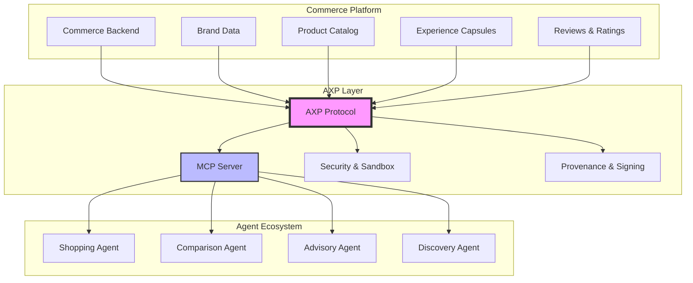
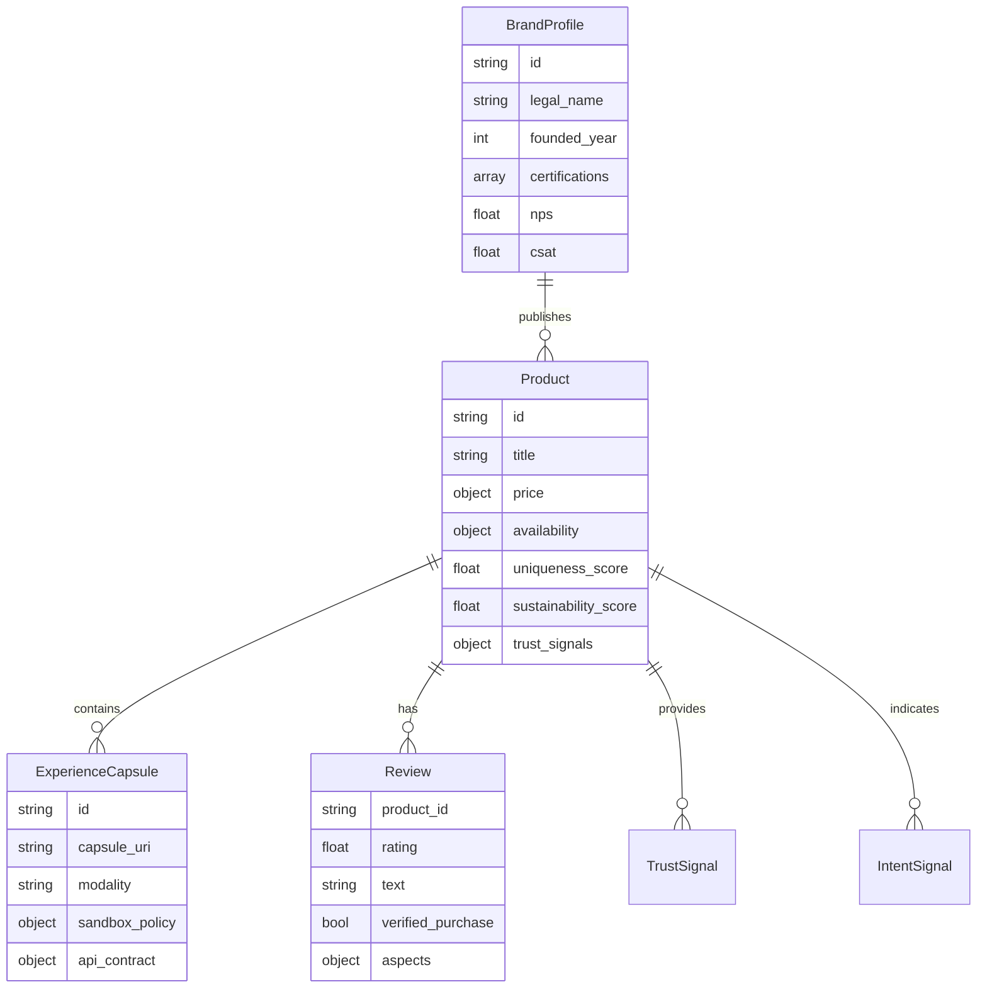
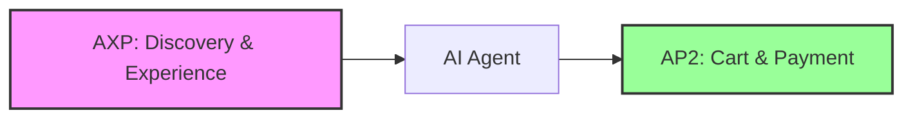

# AXP - Agentic Experience Protocol


## 🎯 Mission

**Making commerce experiences machine-readable for the agentic era.**

AXP (Agentic Experience Protocol) is a standardized data format and minimal MCP interface that enables AI agents to understand not just price and inventory, but the complete story of products and brands – their uniqueness, trust signals, differentiation factors, and rich interactive experiences.

## 🔍 Why AXP?

In the age of AI agents, commerce is fundamentally changing. Agents need more than basic product data – they need to understand:

- **Trust & Authenticity**: Verified reviews, certifications, return rates
- **Uniqueness & Differentiation**: What makes this product special?
- **Rich Experiences**: 3D configurators, AR try-ons, interactive demos
- **Brand Story**: Values, sustainability, craftsmanship signals
- **Customer Intent**: Why people buy and what they use it for

## 🏗️ Architecture Overview



## 🎨 Core Concepts

### 1. **Rich Product Context**
Beyond SKU and price – uniqueness scores, craftsmanship ratings, sustainability metrics, and evidence-backed quality signals.

### 2. **Experience Capsules**
Sandboxed, interactive micro-experiences (3D configurators, AR viewers, size advisors) that agents can safely embed and interact with via standardized PostMessage APIs.

### 3. **Trust Provenance**
Cryptographically signed data with verifiable brand attribution, ensuring agents can trust the information they consume.

### 4. **Intent Signals**
Understanding why customers buy – for daily commute, as a gift, for professional use – enabling better agent recommendations.

## 📦 Data Model



## 🚀 Quick Start

### Installation

```bash
# Clone the repository
git clone https://github.com/yourusername/axp-protocol
cd axp-protocol

# Install dependencies
npm install

# Start the MCP server
npm run server:start

# In another terminal, run example client
npm run demo:client
```

### Basic Usage

```typescript
// Example: Search for unique, sustainable products
const results = await axp.searchCatalog({
  query: "sneakers",
  filters: {
    soft_min: {
      uniqueness_score: 0.7,
      sustainability_score: 0.6
    },
    availability: ["in_stock"]
  },
  limit: 10
});

// Get detailed product with experiences
const product = await axp.getProduct("sku_123");

// Embed interactive experience capsule
const capsule = await axp.getCapsule("cap_sneaker_3d");
// Returns sandboxed iframe configuration
```

## 🔧 Tools & APIs

AXP exposes the following MCP tools:

| Tool | Description |
|------|-------------|
| `axp.getBrandProfile` | Retrieve complete brand information including trust signals |
| `axp.searchCatalog` | Search products with rich filtering on soft signals |
| `axp.getProduct` | Get full product details including experiences and trust data |
| `axp.getExport` | Download complete catalog as signed bundle |
| `axp.getCapsule` | Retrieve sandboxed experience capsule |
| `axp.subscribeInventory` | Real-time inventory updates |

## 🛡️ Security & Privacy

- **Sandboxed Experiences**: Strict CSP policies, no cookies, limited network access
- **Signed Provenance**: All data cryptographically signed by brand keys
- **No PII**: Protocol explicitly excludes personal data
- **Rate Limiting**: Built-in abuse prevention

## 🔗 Integration with AP2

AXP complements the [Agentic Payment Protocol (AP2)](https://github.com/agentic-commerce/ap2) perfectly:



- **AXP** provides context, trust, differentiation, and experiences
- **AP2** handles intent mandates, cart mandates, and payment execution
- Together: Complete agentic commerce stack

## 📊 Example Data

```json
{
  "product": {
    "id": "sku_123",
    "title": "Classic High Top Sneaker Red",
    "price": {"currency": "EUR", "value": 129.90},
    "soft_signals": {
      "uniqueness_score": 0.82,
      "craftsmanship_score": 0.76,
      "sustainability_score": 0.61,
      "evidence": [
        {
          "kind": "certification",
          "name": "Leather Working Group",
          "url": "https://..."
        }
      ]
    },
    "trust_signals": {
      "review_summary": {
        "avg_rating": 4.5,
        "count_total": 1342,
        "top_positive": ["Comfort", "Looks"],
        "top_negative": ["Runs small"]
      },
      "return_rate": 0.14
    },
    "experiences": {
      "capsules": [{
        "id": "cap_sneaker_3d",
        "title": "3D configurator",
        "modality": "canvas3d"
      }]
    }
  }
}
```

## 🎯 Roadmap

- [x] v0.1 - Core protocol definition
- [ ] v0.2 - Advanced capsule modalities (AR, AI advisor)
- [ ] v0.3 - Federated brand networks
- [ ] v0.4 - Cross-agent experience state
- [ ] v1.0 - Production ready

## 🤝 Contributing

We welcome contributions! Please see [CONTRIBUTING.md](docs/CONTRIBUTING.md) for guidelines.

## 📄 License

MIT License - see [LICENSE](LICENSE) for details.

## 🔗 Links

- [Full Specification](docs/SPECIFICATION.md)
- [Integration Guide](docs/INTEGRATION.md)
- [Security Model](docs/SECURITY.md)
- [Example Implementation](examples/)
- [MCP Server](src/server/)

---

**AXP** - Transforming commerce into experiences agents can understand, trust, and act upon.
