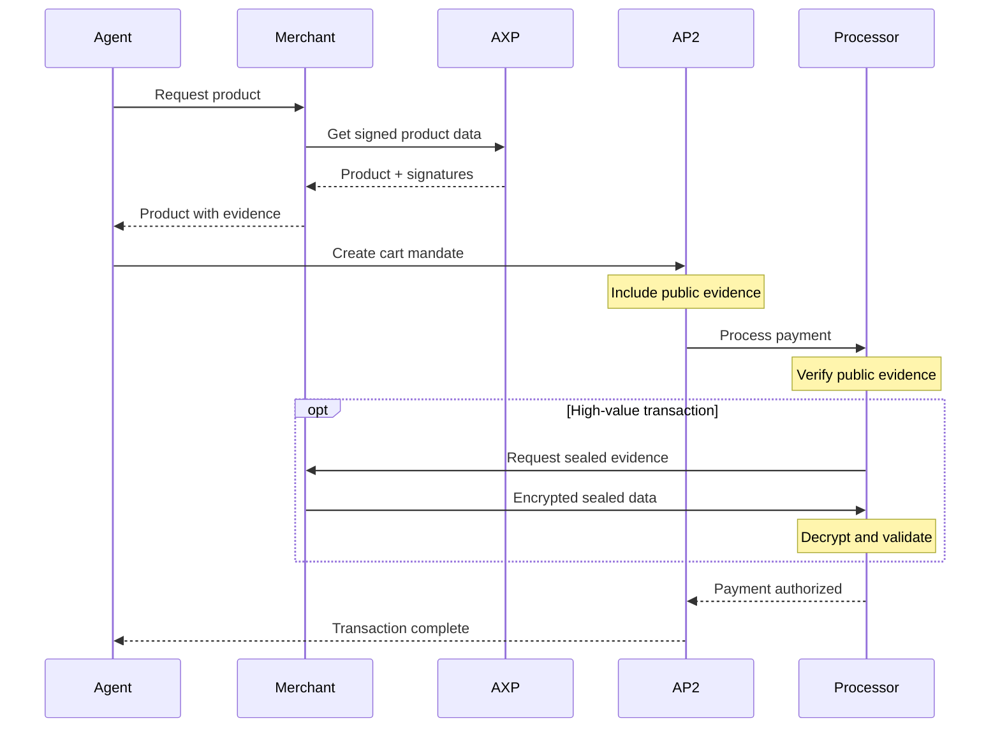

# AP2 Evidence Chain Specification

## Overview

The AP2 Evidence Chain ensures cryptographic proof of AXP data integrity within payment transactions. It separates public evidence (verifiable by all parties) from sealed evidence (sensitive data accessible only to authorized processors).

## Evidence Structure

### Public Evidence (MUST)

**Maximum size: 32KB**
**Retention: Permanent**
**Access: All parties in transaction**

```json
{
  "axp_public_evidence": {
    "brand_profile": {
      "signature": "EdDSA:base64url...",
      "brand_id": "brand_001",
      "trust_score": 0.87,
      "certifications": ["ISO9001", "Trusted_Shops"],
      "retrieved_at": "2025-09-18T10:00:00Z"
    },
    "product": {
      "signature": "EdDSA:base64url...",
      "product_id": "sku_123",
      "review_summary": {
        "avg_rating": 4.5,
        "count_total": 1342,
        "verified_rate": 0.82
      },
      "return_rate": 0.14,
      "trust_signals_snapshot": {
        "uniqueness_score": 0.82,
        "reliability_score": 0.88
      }
    },
    "intent": {
      "declared_intent": "buy running shoes for daily commute",
      "matched_intents": ["daily_commute", "comfort", "durability"],
      "confidence": 0.92,
      "method": "events_plus_text"
    },
    "third_party": {
      "trustpilot": {
        "rating": 4.6,
        "reviews": 12873,
        "verified": true
      },
      "builtwith": {
        "platform": "Shopware",
        "has_ssl": true,
        "has_pwa": true
      }
    }
  }
}
```

### Sealed Evidence (SHOULD for high-value)

**Maximum size: 1MB**
**Retention: 90 days maximum**
**Access: Only authorized AP2 processors**

```json
{
  "axp_sealed_evidence": {
    "encryption": {
      "method": "AES-256-GCM",
      "key_exchange": "ECDH-P256",
      "recipient_key_id": "did:web:ap2processor.com#key-2025"
    },
    "encrypted_payload": "base64url...",
    "metadata": {
      "content_type": "application/json",
      "compressed": true,
      "original_size_bytes": 245678,
      "created_at": "2025-09-18T10:00:00Z"
    }
  }
}
```

#### Sealed Evidence Contents (Decrypted)

```json
{
  "experience_sessions": [
    {
      "session_id": "sess_abc123",
      "capsule_id": "cap_sneaker_3d",
      "events": [
        {
          "type": "configure",
          "timestamp": "2025-09-18T09:45:12Z",
          "params": { "color": "red", "size": "42" },
          "duration_ms": 3400
        },
        {
          "type": "rotate_3d",
          "timestamp": "2025-09-18T09:45:15Z",
          "angle_degrees": 180,
          "duration_ms": 2100
        }
      ],
      "total_duration_seconds": 342,
      "interaction_quality_score": 0.89
    }
  ],
  "behavioral_signals": {
    "comparison_products": ["sku_456", "sku_789"],
    "time_to_decision_seconds": 892,
    "cart_modifications": 2,
    "price_sensitivity_indicator": 0.3
  },
  "device_context": {
    "type": "mobile",
    "os": "iOS",
    "browser": "Safari",
    "viewport": { "width": 390, "height": 844 }
  }
}
```

## Evidence Requirements by Transaction Value

### Low Value (< €100)
- **Public evidence**: OPTIONAL
- **Sealed evidence**: NOT REQUIRED
- **Signatures**: OPTIONAL

### Medium Value (€100 - €1,000)
- **Public evidence**: SHOULD include
- **Sealed evidence**: OPTIONAL
- **Signatures**: SHOULD verify

### High Value (> €1,000)
- **Public evidence**: MUST include
- **Sealed evidence**: SHOULD include
- **Signatures**: MUST verify
- **Additional**: MUST include fresh timestamps (< 7 days)

### B2B Transactions
- **Public evidence**: MUST include
- **Legal data**: MUST include VAT ID, registration
- **Sealed evidence**: MUST include for first transaction
- **Signatures**: MUST verify with key rotation check

## Size Limits and Validation

```typescript
interface EvidenceLimits {
  public_max_bytes: 32768;      // 32KB
  sealed_max_bytes: 1048576;     // 1MB
  signature_max_age_days: 7;     // For high-value
  ttl_cache_seconds: 3600;       // 1 hour cache
}

function validateEvidence(evidence: APXEvidence): ValidationResult {
  const publicSize = JSON.stringify(evidence.public).length;
  const sealedSize = evidence.sealed?.encrypted_payload.length || 0;
  
  if (publicSize > 32768) {
    return { valid: false, error: "Public evidence exceeds 32KB" };
  }
  
  if (sealedSize > 1048576) {
    return { valid: false, error: "Sealed evidence exceeds 1MB" };
  }
  
  // Verify signatures
  if (!verifySignature(evidence.public.brand_profile)) {
    return { valid: false, error: "Invalid brand signature" };
  }
  
  // Check freshness for high-value
  if (transaction.value > 1000) {
    const age = Date.now() - Date.parse(evidence.public.brand_profile.retrieved_at);
    if (age > 7 * 24 * 60 * 60 * 1000) {
      return { valid: false, error: "Evidence too old for high-value transaction" };
    }
  }
  
  return { valid: true };
}
```

## Privacy and Retention

### Data Minimization Principles

1. **Public Evidence**: Only aggregate metrics, no PII
2. **Sealed Evidence**: Session IDs only, no user identifiers
3. **Retention**: Delete sealed evidence after 90 days
4. **Access Logs**: Maintain audit trail of evidence access

### GDPR Compliance

```json
{
  "privacy_metadata": {
    "contains_pii": false,
    "purpose": "fraud_prevention",
    "legal_basis": "legitimate_interest",
    "retention_days": 90,
    "deletion_policy": "automatic",
    "data_categories": ["behavioral", "transactional"]
  }
}
```

## Evidence Chain Verification Flow



## Implementation Checklist

### Merchant Requirements
- [ ] Generate brand and product signatures
- [ ] Implement evidence size limits
- [ ] Support encryption for sealed evidence
- [ ] Provide well-known JWKS endpoint
- [ ] Implement evidence TTL and caching
- [ ] Track third-party evidence freshness

### Agent Requirements
- [ ] Verify all signatures in public evidence
- [ ] Check evidence freshness
- [ ] Validate size limits before submission
- [ ] Handle missing evidence gracefully
- [ ] Cache verified evidence appropriately

### AP2 Processor Requirements
- [ ] Decrypt sealed evidence securely
- [ ] Validate evidence against limits
- [ ] Maintain evidence audit logs
- [ ] Implement retention policies
- [ ] Support key rotation for encryption

## Error Codes

| Code | Description | Action |
|------|-------------|--------|
| AXP_E001 | Public evidence too large | Reduce to essential fields |
| AXP_E002 | Invalid signature | Refresh from source |
| AXP_E003 | Evidence too old | Request fresh evidence |
| AXP_E004 | Sealed decryption failed | Check key exchange |
| AXP_E005 | Missing required evidence | Add required fields |
| AXP_E006 | Untrusted evidence source | Verify provider |

---

*This specification defines normative requirements for AXP evidence in AP2 transactions.*
