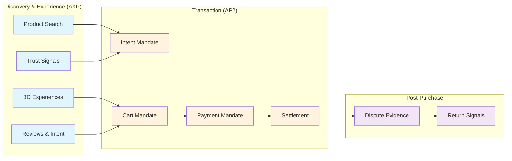

# AXP + AP2 Integration Guide

## Overview

AXP (Agentic Experience Protocol) and AP2 (Agent Payments Protocol) work together to enable complete agent-driven commerce:

- **AXP**: Provides rich product context, trust signals, and interactive experiences
- **AP2**: Handles payment authorization, cart mandates, and transaction completion



## Protocol Synergy

### 1. Discovery to Purchase Flow

```typescript
// Complete agent shopping flow
class AgentShoppingOrchestrator {
  private axpClient: AXPClient;
  private ap2Client: AP2Client;
  
  async shopForUser(userIntent: string): Promise<Order> {
    // Phase 1: Discovery (AXP)
    const products = await this.discoverProducts(userIntent);
    
    // Phase 2: Experience (AXP)
    const selectedProduct = await this.evaluateWithExperiences(products);
    
    // Phase 3: Intent Declaration (AP2)
    const intentMandate = await this.createIntentMandate(userIntent, selectedProduct);
    
    // Phase 4: Cart Creation (AXP + AP2)
    const cartMandate = await this.createEnrichedCart(selectedProduct, intentMandate);
    
    // Phase 5: Payment (AP2)
    const paymentMandate = await this.authorizePayment(cartMandate);
    
    // Phase 6: Settlement (AP2)
    const order = await this.completeTransaction(paymentMandate);
    
    return order;
  }
  
  private async discoverProducts(intent: string): Promise<AXPProduct[]> {
    // Use AXP to find products with rich context
    return this.axpClient.searchCatalog({
      query: intent,
      filters: {
        soft_min: {
          uniqueness_score: 0.7,
          review_rating: 4.0
        }
      }
    });
  }
  
  private async createEnrichedCart(
    product: AXPProduct,
    intentMandate: IntentMandate
  ): Promise<CartMandate> {
    // Combine AXP product data with AP2 cart structure
    return {
      contents: {
        id: `cart_${Date.now()}`,
        payment_request: {
          details: {
            displayItems: [{
              label: product.title,
              amount: product.price,
              // Include AXP metadata for evidence
              metadata: {
                axp_product_id: product.id,
                uniqueness_score: product.soft_signals.uniqueness_score,
                trust_signals: product.trust_signals,
                experience_used: product.experiences_viewed
              }
            }]
          }
        }
      },
      merchant_signature: await this.signCart(product),
      evidence: {
        axp_brand_profile: product.brand_profile_signature,
        axp_product_signature: product.signature
      }
    };
  }
}
```

### 2. Data Model Mapping

| AXP Field | AP2 Field | Usage |
|-----------|-----------|-------|
| `product.id` | `displayItem.sku` | Product identification |
| `product.price` | `displayItem.amount` | Pricing |
| `brand.trust_factors` | `merchant_evidence` | Dispute resolution |
| `product.intent_signals` | `intent_validation` | Intent matching |
| `product.return_rate` | `risk_signals` | Payment risk assessment |
| `brand.certifications` | `merchant_credentials` | Trust establishment |

## Integration Patterns

### Pattern 1: Intent Enrichment

AXP data enhances AP2 intent mandates with context:

```typescript
interface EnrichedIntentMandate extends IntentMandate {
  // Standard AP2 fields
  natural_language_description: string;
  merchants?: string[];
  skus?: string[];
  
  // AXP enrichments
  axp_context?: {
    inferred_intents: Array<{
      intent: string;
      confidence: number;
    }>;
    quality_requirements?: {
      min_uniqueness_score?: number;
      min_sustainability_score?: number;
      required_certifications?: string[];
    };
    experience_preferences?: {
      preferred_modalities: string[];
      interaction_level: 'passive' | 'interactive' | 'immersive';
    };
  };
}

class IntentEnricher {
  enrich(
    basicIntent: string,
    axpProfile: UserPreferences
  ): EnrichedIntentMandate {
    const intents = this.inferIntents(basicIntent);
    
    return {
      natural_language_description: basicIntent,
      intent_expiry: new Date(Date.now() + 3600000).toISOString(),
      user_cart_confirmation_required: false,
      
      // Add AXP context
      axp_context: {
        inferred_intents: intents,
        quality_requirements: this.deriveQualityReqs(intents, axpProfile),
        experience_preferences: axpProfile.experience_prefs
      }
    };
  }
  
  private inferIntents(description: string): IntentSignal[] {
    // Use NLP to extract intent signals
    const intents = [];
    
    if (description.includes('gift')) {
      intents.push({ intent: 'gift_giving', confidence: 0.9 });
    }
    if (description.includes('sustainable') || description.includes('eco')) {
      intents.push({ intent: 'sustainable_shopping', confidence: 0.85 });
    }
    if (description.includes('premium') || description.includes('luxury')) {
      intents.push({ intent: 'luxury_purchase', confidence: 0.8 });
    }
    
    return intents;
  }
}
```

### Pattern 2: Cart Evidence Chain

Include AXP signatures in AP2 cart mandates for verifiability:

```typescript
interface EvidencedCartMandate extends CartMandate {
  // Standard AP2 cart
  contents: CartContents;
  merchant_signature: string;
  timestamp: string;
  
  // AXP evidence chain
  axp_evidence?: {
    brand_profile: {
      signature: string;
      trust_score: number;
      certifications: string[];
    };
    products: Array<{
      id: string;
      signature: string;
      soft_signals: SoftSignals;
      review_summary: ReviewSummary;
    }>;
    experience_sessions?: Array<{
      capsule_id: string;
      interaction_log: string;
      duration_seconds: number;
    }>;
  };
}

class EvidencedCartBuilder {
  async build(
    products: AXPProduct[],
    brand: BrandProfile,
    interactions: ExperienceSession[]
  ): Promise<EvidencedCartMandate> {
    const cart: EvidencedCartMandate = {
      contents: this.buildCartContents(products),
      merchant_signature: await this.signCart(),
      timestamp: new Date().toISOString(),
      
      // Attach AXP evidence
      axp_evidence: {
        brand_profile: {
          signature: brand.signature,
          trust_score: this.calculateTrustScore(brand),
          certifications: brand.certifications
        },
        products: products.map(p => ({
          id: p.id,
          signature: p.signature,
          soft_signals: p.soft_signals,
          review_summary: p.trust_signals.review_summary
        })),
        experience_sessions: interactions.map(s => ({
          capsule_id: s.capsule_id,
          interaction_log: s.encrypted_log,
          duration_seconds: s.duration
        }))
      }
    };
    
    return cart;
  }
}
```

### Pattern 3: Risk Signal Integration

Combine AXP trust signals with AP2 risk assessment:

```typescript
interface CombinedRiskAssessment {
  // AP2 payment risk
  payment_risk: {
    fraud_score: number;
    chargeback_probability: number;
    payment_method_risk: number;
  };
  
  // AXP merchant risk
  merchant_risk: {
    return_rate: number;
    dispute_rate: number;
    csat_score: number;
    operational_risk: number;
  };
  
  // AXP product risk
  product_risk: {
    return_probability: number;
    satisfaction_prediction: number;
    intent_match_score: number;
  };
  
  // Combined score
  overall_risk_score: number;
  recommended_action: 'approve' | 'review' | 'decline';
}

class RiskAggregator {
  assess(
    paymentData: PaymentMandate,
    axpData: AXPContext
  ): CombinedRiskAssessment {
    const paymentRisk = this.assessPaymentRisk(paymentData);
    const merchantRisk = this.assessMerchantRisk(axpData.brand);
    const productRisk = this.assessProductRisk(axpData.products);
    
    // Weighted combination
    const overall = (
      paymentRisk * 0.4 +
      merchantRisk * 0.3 +
      productRisk * 0.3
    );
    
    return {
      payment_risk: paymentRisk,
      merchant_risk: merchantRisk,
      product_risk: productRisk,
      overall_risk_score: overall,
      recommended_action: this.deriveAction(overall)
    };
  }
  
  private assessProductRisk(products: AXPProduct[]): number {
    // Analyze return patterns
    const avgReturnRate = products.reduce(
      (sum, p) => sum + p.trust_signals.return_rate, 0
    ) / products.length;
    
    // Check intent alignment
    const intentMatch = products.reduce(
      (sum, p) => sum + this.calculateIntentMatch(p), 0
    ) / products.length;
    
    // Combine factors
    return (avgReturnRate * 0.6) + ((1 - intentMatch) * 0.4);
  }
}
```

## Dispute Resolution

### Evidence Collection

When disputes arise, combine AXP and AP2 data:

```typescript
interface DisputeEvidencePackage {
  // AP2 transaction evidence
  ap2_evidence: {
    intent_mandate: IntentMandate;
    cart_mandate: CartMandate;
    payment_mandate: PaymentMandate;
    transaction_log: TransactionLog[];
  };
  
  // AXP context evidence
  axp_evidence: {
    product_state_at_purchase: {
      description: string;
      images: string[];
      price: Price;
      availability: Availability;
    };
    brand_reputation_at_purchase: {
      trust_score: number;
      ratings: IndependentRating[];
      certifications: string[];
    };
    experience_interaction_log: {
      capsules_viewed: string[];
      interaction_duration: number;
      configuration_choices: any;
    };
    delivery_evidence?: {
      tracking_number: string;
      delivery_confirmation: string;
      signature: string;
    };
  };
  
  // Combined analysis
  dispute_analysis: {
    intent_fulfillment_score: number;
    product_match_score: number;
    merchant_compliance_score: number;
    recommended_resolution: string;
  };
}

class DisputeEvidenceCollector {
  async collectEvidence(
    disputeId: string,
    transactionId: string
  ): Promise<DisputeEvidencePackage> {
    // Gather AP2 transaction data
    const ap2Evidence = await this.ap2Client.getTransactionEvidence(transactionId);
    
    // Gather AXP context from the time of purchase
    const purchaseTimestamp = ap2Evidence.cart_mandate.timestamp;
    const axpEvidence = await this.getHistoricalAXPData(
      ap2Evidence.cart_mandate.contents.displayItems[0].sku,
      purchaseTimestamp
    );
    
    // Analyze for dispute resolution
    const analysis = this.analyzeDispute(ap2Evidence, axpEvidence);
    
    return {
      ap2_evidence: ap2Evidence,
      axp_evidence: axpEvidence,
      dispute_analysis: analysis
    };
  }
  
  private analyzeDispute(ap2: any, axp: any): DisputeAnalysis {
    return {
      intent_fulfillment_score: this.checkIntentMatch(
        ap2.intent_mandate,
        axp.product_state_at_purchase
      ),
      product_match_score: this.verifyProductDelivered(
        ap2.cart_mandate,
        axp.delivery_evidence
      ),
      merchant_compliance_score: this.assessMerchantCompliance(
        axp.brand_reputation_at_purchase,
        ap2.transaction_log
      ),
      recommended_resolution: this.recommendResolution()
    };
  }
}
```

### Automated Resolution

Use combined signals for automatic dispute decisions:

```typescript
class AutomatedDisputeResolver {
  async resolve(evidence: DisputeEvidencePackage): Promise<Resolution> {
    const score = evidence.dispute_analysis;
    
    // Clear merchant fault
    if (score.merchant_compliance_score < 0.5) {
      return {
        decision: 'refund',
        reason: 'Merchant failed to meet obligations',
        evidence_keys: ['low_compliance_score', 'return_pattern']
      };
    }
    
    // Clear buyer fault
    if (score.intent_fulfillment_score > 0.9 && 
        score.product_match_score > 0.95) {
      return {
        decision: 'deny_refund',
        reason: 'Product delivered as described',
        evidence_keys: ['high_match_scores', 'delivery_confirmation']
      };
    }
    
    // Ambiguous - needs human review
    return {
      decision: 'escalate',
      reason: 'Requires manual review',
      suggested_actions: this.suggestActions(evidence)
    };
  }
}
```

## Implementation Examples

### 1. Unified Agent Client

```typescript
// Complete AXP + AP2 client
class UnifiedCommerceAgent {
  private axp: AXPClient;
  private ap2: AP2Client;
  
  constructor(config: AgentConfig) {
    this.axp = new AXPClient({
      endpoint: config.axp_endpoint,
      credentials: config.axp_credentials
    });
    
    this.ap2 = new AP2Client({
      endpoint: config.ap2_endpoint,
      credentials: config.ap2_credentials
    });
  }
  
  async executeUserIntent(intent: string): Promise<PurchaseResult> {
    try {
      // 1. Handshake with merchant (AXP)
      const session = await this.axp.handshake();
      
      // 2. Search and evaluate products (AXP)
      const products = await this.searchAndEvaluate(intent, session);
      
      // 3. Interactive experience if needed (AXP)
      const selection = await this.interactiveSelection(products);
      
      // 4. Create intent mandate (AP2)
      const intentMandate = await this.ap2.createIntentMandate({
        description: intent,
        context: selection.axp_context
      });
      
      // 5. Get cart from merchant (AP2 + AXP)
      const cart = await this.requestCart(selection, intentMandate);
      
      // 6. Authorize payment (AP2)
      const payment = await this.ap2.authorizePayment(cart);
      
      // 7. Complete purchase (AP2)
      const order = await this.ap2.completePurchase(payment);
      
      // 8. Store evidence (AXP + AP2)
      await this.storeTransactionEvidence(order, selection, session);
      
      return { success: true, order };
      
    } catch (error) {
      return this.handleError(error);
    }
  }
}
```

### 2. Merchant Integration

```typescript
// Merchant server supporting both protocols
class MerchantServer {
  // AXP endpoints
  @Get('/.well-known/axp-manifest')
  async getAXPManifest() {
    return this.axpService.getManifest();
  }
  
  @Post('/axp/v1/handshake')
  async axpHandshake(req: Request) {
    return this.axpService.handshake(req);
  }
  
  @Get('/axp/v1/products')
  async searchProducts(query: AXPQuery) {
    return this.axpService.searchCatalog(query);
  }
  
  // AP2 endpoints
  @Get('/.well-known/ap2-manifest')
  async getAP2Manifest() {
    return this.ap2Service.getManifest();
  }
  
  @Post('/ap2/v1/cart')
  async createCart(intentMandate: IntentMandate) {
    // Use AXP data to enrich cart
    const products = await this.matchProductsToIntent(intentMandate);
    const axpContext = await this.axpService.getProductContext(products);
    
    return this.ap2Service.createCart(intentMandate, axpContext);
  }
  
  @Post('/ap2/v1/payment')
  async processPayment(paymentMandate: PaymentMandate) {
    // Validate using combined risk assessment
    const axpRisk = await this.axpService.assessRisk(paymentMandate);
    const ap2Risk = await this.ap2Service.assessRisk(paymentMandate);
    
    if (this.combineRiskScores(axpRisk, ap2Risk) > 0.7) {
      throw new Error('Payment declined due to high risk');
    }
    
    return this.ap2Service.processPayment(paymentMandate);
  }
}
```

### 3. Credentials Provider Bridge

```typescript
// Verifiable credentials for trust signals
class AXPCredentialsProvider {
  async issueProductCredential(
    product: AXPProduct
  ): Promise<VerifiableCredential> {
    const credential = {
      '@context': [
        'https://www.w3.org/2018/credentials/v1',
        'https://agentic-commerce.org/axp/v1/context'
      ],
      type: ['VerifiableCredential', 'AXPProductCredential'],
      issuer: this.issuerId,
      issuanceDate: new Date().toISOString(),
      credentialSubject: {
        id: `axp:product:${product.id}`,
        uniquenessScore: product.soft_signals.uniqueness_score,
        sustainabilityScore: product.soft_signals.sustainability_score,
        reviewRating: product.trust_signals.review_summary.avg_rating,
        returnRate: product.trust_signals.return_rate,
        certifications: product.certifications
      },
      proof: await this.generateProof(product)
    };
    
    return credential;
  }
  
  async verifyForPayment(
    credential: VerifiableCredential,
    cartMandate: CartMandate
  ): Promise<boolean> {
    // Verify credential is valid
    if (!await this.verifyCredential(credential)) {
      return false;
    }
    
    // Check credential matches cart items
    const productId = credential.credentialSubject.id.split(':')[2];
    const inCart = cartMandate.contents.displayItems.some(
      item => item.sku === productId
    );
    
    // Verify not expired (credentials valid for 24 hours)
    const issued = new Date(credential.issuanceDate);
    const age = Date.now() - issued.getTime();
    
    return inCart && age < 86400000;
  }
}
```

## Configuration Examples

### Environment Variables

```bash
# AXP Configuration
AXP_ENDPOINT=https://api.merchant.com/axp/v1
AXP_PUBLIC_KEY_ID=did:web:merchant.com#key-1
AXP_SESSION_TIMEOUT=3600
AXP_MAX_CAPSULES=10

# AP2 Configuration  
AP2_ENDPOINT=https://api.merchant.com/ap2/v1
AP2_MERCHANT_ID=merchant_123
AP2_PAYMENT_PROCESSOR=https://payments.processor.com
AP2_DISPUTE_HANDLER=https://disputes.processor.com

# Combined Configuration
UNIFIED_RISK_THRESHOLD=0.7
EVIDENCE_RETENTION_DAYS=365
DISPUTE_AUTO_RESOLVE=true
CREDENTIAL_ISSUER_ID=did:web:merchant.com
```

### Docker Compose Setup

```yaml
version: '3.8'

services:
  axp-server:
    image: merchant/axp-server:latest
    environment:
      - DATABASE_URL=postgresql://db:5432/axp
      - REDIS_URL=redis://cache:6379
    ports:
      - "8080:8080"
    volumes:
      - ./certs:/app/certs:ro
      
  ap2-server:
    image: merchant/ap2-server:latest
    environment:
      - DATABASE_URL=postgresql://db:5432/ap2
      - AXP_INTERNAL_URL=http://axp-server:8080
    ports:
      - "8081:8081"
      
  unified-gateway:
    image: merchant/unified-gateway:latest
    environment:
      - AXP_UPSTREAM=http://axp-server:8080
      - AP2_UPSTREAM=http://ap2-server:8081
    ports:
      - "443:443"
    depends_on:
      - axp-server
      - ap2-server
      
  db:
    image: postgres:15
    environment:
      - POSTGRES_PASSWORD=secret
    volumes:
      - db-data:/var/lib/postgresql/data
      
  cache:
    image: redis:7-alpine
    command: redis-server --appendonly yes
    volumes:
      - cache-data:/data

volumes:
  db-data:
  cache-data:
```

## Testing Integration

### Integration Test Suite

```typescript
describe('AXP + AP2 Integration', () => {
  let axpClient: AXPClient;
  let ap2Client: AP2Client;
  let orchestrator: AgentShoppingOrchestrator;
  
  beforeEach(() => {
    axpClient = new AXPClient(testConfig.axp);
    ap2Client = new AP2Client(testConfig.ap2);
    orchestrator = new AgentShoppingOrchestrator(axpClient, ap2Client);
  });
  
  test('Complete purchase flow with rich context', async () => {
    // 1. Search with AXP
    const products = await axpClient.searchCatalog({
      query: 'sustainable running shoes',
      filters: { soft_min: { sustainability_score: 0.7 } }
    });
    expect(products).toHaveLength(greaterThan(0));
    
    // 2. Create intent with AP2
    const intent = await ap2Client.createIntentMandate({
      natural_language_description: 'sustainable running shoes size 42',
      required_refundability: true
    });
    expect(intent).toHaveProperty('mandate_id');
    
    // 3. Get enriched cart
    const cart = await orchestrator.createEnrichedCart(
      products[0],
      intent
    );
    expect(cart.axp_evidence).toBeDefined();
    expect(cart.contents.displayItems[0].metadata).toHaveProperty('sustainability_score');
    
    // 4. Process payment
    const payment = await ap2Client.authorizePayment(cart);
    expect(payment.status).toBe('authorized');
    
    // 5. Verify evidence chain
    const evidence = await orchestrator.getTransactionEvidence(payment.transaction_id);
    expect(evidence.axp_evidence).toBeDefined();
    expect(evidence.ap2_evidence).toBeDefined();
  });
  
  test('Dispute resolution with combined evidence', async () => {
    const disputeId = 'dispute_test_123';
    const evidence = await orchestrator.gatherDisputeEvidence(disputeId);
    
    expect(evidence).toHaveProperty('axp_evidence.product_state_at_purchase');
    expect(evidence).toHaveProperty('ap2_evidence.intent_mandate');
    expect(evidence.dispute_analysis.recommended_resolution).toBeDefined();
  });
});
```

## Monitoring & Analytics

### Key Metrics

```typescript
interface IntegrationMetrics {
  // Conversion metrics
  axp_to_ap2_conversion_rate: number;  // Products viewed → carts created
  cart_to_payment_conversion: number;   // Carts → successful payments
  
  // Quality metrics
  intent_match_score: number;           // How well products match intent
  experience_engagement_rate: number;   // % using 3D/AR experiences
  
  // Trust metrics
  dispute_rate_by_trust_score: Map<number, number>;
  return_rate_by_uniqueness_score: Map<number, number>;
  
  // Performance metrics
  total_latency_ms: number;             // AXP discovery + AP2 payment
  evidence_generation_time_ms: number;
}

class IntegrationMonitor {
  async collectMetrics(): Promise<IntegrationMetrics> {
    const metrics = {
      axp_to_ap2_conversion_rate: await this.calculateConversion(),
      intent_match_score: await this.calculateIntentMatch(),
      // ... collect all metrics
    };
    
    // Alert on anomalies
    if (metrics.dispute_rate_by_trust_score.get(0.9) > 0.02) {
      await this.alert('High dispute rate for high-trust merchants');
    }
    
    return metrics;
  }
}
```

## Best Practices

### 1. Data Consistency

- Always include timestamps in both protocols
- Use consistent product IDs across AXP and AP2
- Sign all critical data for non-repudiation

### 2. Performance Optimization

- Cache AXP product data during AP2 transactions
- Pre-fetch trust signals for high-intent users
- Use event streams for real-time updates

### 3. Security Considerations

- Validate all cross-protocol references
- Implement replay attack prevention
- Maintain separate auth tokens for each protocol

### 4. User Experience

- Show AXP trust signals during AP2 checkout
- Use AXP experiences to reduce cart abandonment
- Provide unified dispute resolution interface

## Migration Guide

For merchants already using AP2:

1. **Phase 1**: Add AXP manifest endpoint
2. **Phase 2**: Enrich products with soft signals
3. **Phase 3**: Add experience capsules
4. **Phase 4**: Integrate evidence in disputes
5. **Phase 5**: Full bidirectional integration

## References

- [AXP Specification](./SPECIFICATION.md)
- [AP2 Specification](https://github.com/google-agentic-commerce/AP2)
- [W3C Verifiable Credentials](https://www.w3.org/TR/vc-data-model/)
- [A2A Protocol](https://a2a-protocol.org/)
