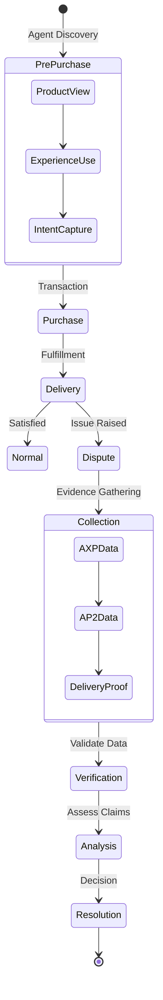

# AXP Dispute Evidence Collection & Verification

## Overview

The AXP protocol provides comprehensive evidence collection for dispute resolution, ensuring fair outcomes through verifiable data chains. This complements AP2's payment dispute handling with rich context about products, experiences, and merchant trust signals.

## Evidence Lifecycle



## Evidence Types

### 1. Product State Evidence

Captures the exact state of product information at purchase time:

```typescript
interface ProductStateEvidence {
  timestamp: string;  // ISO 8601 timestamp of purchase
  product_snapshot: {
    id: string;
    title: string;
    description: string;
    price: Price;
    images: Array<{
      url: string;
      hash: string;  // SHA-256 of image at time
      caption: string;
    }>;
    tech_specs: any;
    availability: {
      state: string;
      quantity: number;
    };
  };
  soft_signals_snapshot: {
    uniqueness_score: number;
    craftsmanship_score: number;
    sustainability_score: number;
    innovation_score: number;
  };
  trust_signals_snapshot: {
    avg_rating: number;
    review_count: number;
    return_rate: number;
    warranty_terms: string;
  };
  signature: string;  // Cryptographic signature
}
```

#### Collection Implementation

```typescript
class ProductStateCollector {
  async captureAtPurchase(
    productId: string,
    transactionId: string
  ): Promise<ProductStateEvidence> {
    const product = await this.getProduct(productId);
    const timestamp = new Date().toISOString();
    
    // Create immutable snapshot
    const snapshot = {
      timestamp,
      product_snapshot: this.snapshotProduct(product),
      soft_signals_snapshot: product.soft_signals,
      trust_signals_snapshot: product.trust_signals,
      signature: ''
    };
    
    // Sign the evidence
    snapshot.signature = await this.signEvidence(snapshot);
    
    // Store with transaction
    await this.evidenceStore.store(transactionId, 'product_state', snapshot);
    
    // Archive images
    await this.archiveProductImages(product.media.images, transactionId);
    
    return snapshot;
  }
  
  private async archiveProductImages(images: Image[], transactionId: string) {
    for (const image of images) {
      const imageData = await fetch(image.url);
      const buffer = await imageData.arrayBuffer();
      const hash = await this.hashBuffer(buffer);
      
      // Store image with hash verification
      await this.imageArchive.store(transactionId, image.url, buffer, hash);
    }
  }
}
```

### 2. Experience Interaction Evidence

Records how the user interacted with product experiences:

```typescript
interface ExperienceInteractionEvidence {
  session_id: string;
  capsule_id: string;
  interaction_log: Array<{
    timestamp: string;
    event_type: string;
    event_data: any;
    user_input?: any;
  }>;
  duration_seconds: number;
  configuration_choices: {
    color?: string;
    size?: string;
    customizations?: any;
  };
  view_analytics: {
    zoom_interactions: number;
    rotation_degrees: number;
    features_explored: string[];
  };
  encrypted_session_recording?: string;  // Optional video recording
}
```

#### Interaction Tracking

```typescript
class ExperienceTracker {
  private interactions: Map<string, InteractionLog> = new Map();
  
  startSession(sessionId: string, capsuleId: string) {
    this.interactions.set(sessionId, {
      capsule_id: capsuleId,
      events: [],
      start_time: Date.now()
    });
  }
  
  trackEvent(sessionId: string, event: InteractionEvent) {
    const log = this.interactions.get(sessionId);
    if (!log) return;
    
    log.events.push({
      timestamp: new Date().toISOString(),
      event_type: event.type,
      event_data: event.data,
      user_input: event.userInput
    });
    
    // Real-time persistence for reliability
    this.persistEvent(sessionId, event);
  }
  
  async finalizeSession(sessionId: string): Promise<ExperienceInteractionEvidence> {
    const log = this.interactions.get(sessionId);
    if (!log) throw new Error('Session not found');
    
    const duration = (Date.now() - log.start_time) / 1000;
    
    const evidence: ExperienceInteractionEvidence = {
      session_id: sessionId,
      capsule_id: log.capsule_id,
      interaction_log: log.events,
      duration_seconds: duration,
      configuration_choices: this.extractChoices(log.events),
      view_analytics: this.calculateAnalytics(log.events),
      encrypted_session_recording: await this.getRecording(sessionId)
    };
    
    // Sign and store
    const signed = await this.signEvidence(evidence);
    await this.evidenceStore.store(sessionId, 'experience', signed);
    
    return evidence;
  }
}
```

### 3. Brand Trust Evidence

Merchant reputation at time of purchase:

```typescript
interface BrandTrustEvidence {
  timestamp: string;
  brand_id: string;
  trust_metrics: {
    overall_trust_score: number;
    csat: number;
    nps: number;
    return_rate: number;
    dispute_rate: number;
    resolution_time_hours: number;
  };
  certifications_active: Array<{
    name: string;
    issuer: string;
    expiry: string;
    verified: boolean;
  }>;
  ratings_snapshot: Array<{
    source: string;
    score: number;
    count: number;
    last_updated: string;
  }>;
  recent_disputes: {
    count_30d: number;
    resolution_rate: number;
    avg_resolution_days: number;
  };
}
```

### 4. Intent Fulfillment Evidence

Proves whether delivered product matches original intent:

```typescript
interface IntentFulfillmentEvidence {
  intent_description: string;
  intent_keywords: string[];
  product_delivered: {
    id: string;
    title: string;
    matched_keywords: string[];
  };
  match_analysis: {
    semantic_similarity: number;  // 0-1 score
    keyword_coverage: number;     // % of keywords matched
    category_match: boolean;
    specification_match: Map<string, boolean>;
  };
  alternatives_shown: Array<{
    product_id: string;
    reason_not_selected: string;
  }>;
}
```

## Evidence Verification

### Cryptographic Verification

```typescript
class EvidenceVerifier {
  async verifyEvidence(evidence: any): Promise<VerificationResult> {
    // 1. Check signature
    const signatureValid = await this.verifySignature(
      evidence.signature,
      evidence
    );
    
    // 2. Verify timestamp
    const timestampValid = this.verifyTimestamp(evidence.timestamp);
    
    // 3. Check data integrity
    const integrityValid = await this.verifyIntegrity(evidence);
    
    // 4. Validate against blockchain (if enabled)
    const blockchainValid = await this.verifyOnChain(evidence);
    
    return {
      valid: signatureValid && timestampValid && integrityValid,
      checks: {
        signature: signatureValid,
        timestamp: timestampValid,
        integrity: integrityValid,
        blockchain: blockchainValid
      },
      trust_score: this.calculateTrustScore(evidence)
    };
  }
  
  private async verifyIntegrity(evidence: any): Promise<boolean> {
    // Verify images haven't been altered
    if (evidence.product_snapshot?.images) {
      for (const image of evidence.product_snapshot.images) {
        const currentHash = await this.hashUrl(image.url);
        if (currentHash !== image.hash) {
          console.warn(`Image altered: ${image.url}`);
          return false;
        }
      }
    }
    
    // Verify data consistency
    return this.checkDataConsistency(evidence);
  }
}
```

### Tamper Detection

```typescript
class TamperDetector {
  async detectTampering(
    evidence: Evidence[],
    timeline: TimelineEntry[]
  ): Promise<TamperAnalysis> {
    const anomalies = [];
    
    // Check chronological consistency
    for (let i = 1; i < timeline.length; i++) {
      if (new Date(timeline[i].timestamp) < new Date(timeline[i-1].timestamp)) {
        anomalies.push({
          type: 'chronological_inconsistency',
          details: `Event ${i} predates event ${i-1}`
        });
      }
    }
    
    // Check for impossible state transitions
    const stateTransitions = this.extractStateTransitions(evidence);
    for (const transition of stateTransitions) {
      if (!this.isValidTransition(transition)) {
        anomalies.push({
          type: 'invalid_state_transition',
          details: transition
        });
      }
    }
    
    // Check for data manipulation patterns
    const manipulationScore = await this.detectManipulationPatterns(evidence);
    if (manipulationScore > 0.7) {
      anomalies.push({
        type: 'potential_manipulation',
        confidence: manipulationScore
      });
    }
    
    return {
      tampered: anomalies.length > 0,
      anomalies,
      confidence: this.calculateConfidence(anomalies)
    };
  }
}
```

## Dispute Analysis

### Automated Analysis Engine

```typescript
class DisputeAnalyzer {
  async analyzeDispute(
    claim: DisputeClaim,
    evidence: EvidencePackage
  ): Promise<DisputeAnalysis> {
    // 1. Classify dispute type
    const disputeType = this.classifyDispute(claim);
    
    // 2. Run type-specific analysis
    let analysis: TypeSpecificAnalysis;
    
    switch (disputeType) {
      case 'product_not_as_described':
        analysis = await this.analyzeProductMismatch(claim, evidence);
        break;
      
      case 'quality_issue':
        analysis = await this.analyzeQualityComplaint(claim, evidence);
        break;
      
      case 'non_delivery':
        analysis = await this.analyzeDeliveryIssue(claim, evidence);
        break;
      
      case 'wrong_item':
        analysis = await this.analyzeWrongItem(claim, evidence);
        break;
        
      default:
        analysis = await this.genericAnalysis(claim, evidence);
    }
    
    // 3. Calculate fault attribution
    const faultAttribution = await this.attributeFault(analysis, evidence);
    
    // 4. Generate recommendation
    const recommendation = this.generateRecommendation(
      faultAttribution,
      claim.requested_resolution
    );
    
    return {
      dispute_type: disputeType,
      analysis,
      fault_attribution: faultAttribution,
      recommendation,
      confidence_score: analysis.confidence,
      supporting_evidence: this.gatherSupportingEvidence(analysis)
    };
  }
  
  private async analyzeProductMismatch(
    claim: DisputeClaim,
    evidence: EvidencePackage
  ): Promise<TypeSpecificAnalysis> {
    const productAtPurchase = evidence.product_state;
    const productDelivered = claim.product_received;
    
    // Compare descriptions
    const descriptionMatch = await this.semanticSimilarity(
      productAtPurchase.description,
      productDelivered.description
    );
    
    // Compare specifications
    const specMatch = this.compareSpecifications(
      productAtPurchase.tech_specs,
      productDelivered.reported_specs
    );
    
    // Image comparison (if provided)
    const imageMatch = claim.evidence_images ? 
      await this.compareImages(
        productAtPurchase.images,
        claim.evidence_images
      ) : null;
    
    return {
      match_scores: {
        description: descriptionMatch,
        specifications: specMatch,
        images: imageMatch
      },
      conclusion: this.deriveConclusion(descriptionMatch, specMatch, imageMatch),
      confidence: this.calculateConfidence([descriptionMatch, specMatch, imageMatch])
    };
  }
}
```

### Fault Attribution

```typescript
class FaultAttributor {
  async attributeFault(
    analysis: TypeSpecificAnalysis,
    evidence: EvidencePackage
  ): Promise<FaultAttribution> {
    const factors = {
      merchant: 0,
      customer: 0,
      carrier: 0,
      unclear: 0
    };
    
    // Analyze merchant factors
    if (analysis.product_mismatch_confirmed) {
      factors.merchant += 0.8;
    }
    if (evidence.brand_trust.recent_disputes.count_30d > 10) {
      factors.merchant += 0.1;
    }
    if (evidence.product_state.return_rate > 0.3) {
      factors.merchant += 0.1;
    }
    
    // Analyze customer factors
    if (analysis.intent_mismatch) {
      factors.customer += 0.3;
    }
    if (evidence.experience_interaction.duration_seconds < 10) {
      factors.customer += 0.2;  // Didn't properly review
    }
    if (analysis.unreasonable_expectations) {
      factors.customer += 0.5;
    }
    
    // Analyze carrier factors
    if (evidence.delivery.damage_reported) {
      factors.carrier += 0.7;
    }
    if (evidence.delivery.delay_days > 7) {
      factors.carrier += 0.3;
    }
    
    // Normalize
    const total = Object.values(factors).reduce((a, b) => a + b, 0);
    if (total === 0) {
      factors.unclear = 1;
    } else {
      for (const key in factors) {
        factors[key] = factors[key] / total;
      }
    }
    
    return {
      primary_fault: this.getPrimaryFault(factors),
      attribution_scores: factors,
      evidence_strength: this.assessEvidenceStrength(evidence),
      recommendation_confidence: this.calculateConfidence(factors)
    };
  }
}
```

## Resolution Workflows

### Automated Resolution

```typescript
class AutomatedResolver {
  async resolve(
    dispute: Dispute,
    analysis: DisputeAnalysis
  ): Promise<Resolution> {
    // Check if eligible for automation
    if (!this.isEligibleForAutomation(analysis)) {
      return this.escalateToHuman(dispute, analysis);
    }
    
    const resolution = await this.determineResolution(analysis);
    
    // Execute resolution
    switch (resolution.type) {
      case 'full_refund':
        return await this.processFullRefund(dispute, resolution);
      
      case 'partial_refund':
        return await this.processPartialRefund(dispute, resolution);
      
      case 'replacement':
        return await this.processReplacement(dispute, resolution);
      
      case 'deny':
        return await this.denyDispute(dispute, resolution);
      
      default:
        return this.escalateToHuman(dispute, analysis);
    }
  }
  
  private async processFullRefund(
    dispute: Dispute,
    resolution: ResolutionPlan
  ): Promise<Resolution> {
    // Initiate refund
    const refund = await this.paymentProcessor.refund({
      transaction_id: dispute.transaction_id,
      amount: dispute.original_amount,
      reason: resolution.reason
    });
    
    // Update metrics
    await this.metrics.recordRefund(dispute.merchant_id, dispute.product_id);
    
    // Generate evidence package
    const evidencePackage = await this.generateEvidencePackage(
      dispute,
      resolution,
      refund
    );
    
    // Notify parties
    await this.notifyParties({
      customer: dispute.customer_id,
      merchant: dispute.merchant_id,
      resolution: 'full_refund',
      evidence: evidencePackage
    });
    
    return {
      dispute_id: dispute.id,
      resolution_type: 'full_refund',
      amount: refund.amount,
      evidence_package: evidencePackage,
      timestamp: new Date().toISOString(),
      automated: true
    };
  }
}
```

### Evidence Requirements by Dispute Type

| Dispute Type | Required Evidence | Optional Evidence | Auto-Resolution Threshold |
|--------------|------------------|-------------------|---------------------------|
| Not as Described | Product state, Images | Experience log | 85% confidence |
| Quality Issue | Product state, Reviews | Return history | 80% confidence |
| Non-Delivery | Tracking, Delivery proof | Carrier status | 90% confidence |
| Wrong Item | Order details, Images | Warehouse logs | 85% confidence |
| Damaged | Images, Carrier report | Packaging photos | 75% confidence |

## Implementation Examples

### 1. Evidence Collection Middleware

```typescript
// Express middleware for evidence collection
const evidenceCollectionMiddleware = (collector: EvidenceCollector) => {
  return async (req: Request, res: Response, next: NextFunction) => {
    // Start evidence collection for purchases
    if (req.path === '/checkout/complete') {
      const transactionId = req.body.transaction_id;
      const productIds = req.body.product_ids;
      
      // Async evidence collection
      collector.collectPurchaseEvidence(transactionId, productIds)
        .catch(err => console.error('Evidence collection failed:', err));
    }
    
    // Track experience interactions
    if (req.path.startsWith('/experience/')) {
      const sessionId = req.session.id;
      const event = {
        type: req.method,
        path: req.path,
        data: req.body,
        timestamp: new Date().toISOString()
      };
      
      collector.trackExperienceEvent(sessionId, event);
    }
    
    next();
  };
};
```

### 2. Blockchain Evidence Anchoring

```typescript
// Optional blockchain anchoring for high-value transactions
class BlockchainAnchor {
  async anchorEvidence(evidence: Evidence): Promise<AnchorProof> {
    // Create evidence hash
    const hash = await this.hashEvidence(evidence);
    
    // Create Merkle tree for batch anchoring
    const merkleTree = this.getMerkleTree();
    merkleTree.addLeaf(hash);
    
    // Anchor to blockchain (every 10 minutes)
    if (merkleTree.shouldAnchor()) {
      const root = merkleTree.getRoot();
      const txHash = await this.blockchain.anchor(root);
      
      return {
        evidence_hash: hash,
        merkle_root: root,
        merkle_proof: merkleTree.getProof(hash),
        blockchain_tx: txHash,
        timestamp: new Date().toISOString()
      };
    }
    
    return {
      evidence_hash: hash,
      pending_anchor: true,
      estimated_anchor_time: merkleTree.nextAnchorTime()
    };
  }
}
```

### 3. Evidence API Endpoints

```typescript
// RESTful API for evidence access
router.get('/evidence/:transactionId', async (req, res) => {
  const { transactionId } = req.params;
  
  // Verify requester authorization
  const authorized = await verifyAuthorization(req, transactionId);
  if (!authorized) {
    return res.status(403).json({ error: 'Unauthorized' });
  }
  
  // Gather all evidence
  const evidence = await evidenceStore.getTransactionEvidence(transactionId);
  
  // Verify integrity
  const verification = await evidenceVerifier.verifyAll(evidence);
  
  res.json({
    transaction_id: transactionId,
    evidence,
    verification,
    generated_at: new Date().toISOString()
  });
});

router.post('/dispute/:disputeId/analyze', async (req, res) => {
  const { disputeId } = req.params;
  const dispute = await disputeStore.get(disputeId);
  
  // Collect evidence
  const evidence = await evidenceCollector.collectForDispute(dispute);
  
  // Analyze
  const analysis = await disputeAnalyzer.analyze(dispute, evidence);
  
  // Store analysis
  await disputeStore.storeAnalysis(disputeId, analysis);
  
  res.json({
    dispute_id: disputeId,
    analysis,
    recommendation: analysis.recommendation,
    confidence: analysis.confidence_score
  });
});
```

## Best Practices

### 1. Evidence Retention

```typescript
const retentionPolicy = {
  standard_purchases: 365,      // 1 year
  disputed_transactions: 2555,  // 7 years
  high_value_transactions: 1825, // 5 years
  experience_logs: 90,          // 90 days
  temporary_sessions: 30        // 30 days
};
```

### 2. Privacy Compliance

- Anonymize PII in evidence
- Implement right to deletion
- Encrypt sensitive data
- Audit access logs

### 3. Performance Optimization

```typescript
// Async evidence collection
class AsyncEvidenceCollector {
  async collectInBackground(transactionId: string) {
    // Critical evidence (synchronous)
    const critical = await this.collectCritical(transactionId);
    
    // Additional evidence (asynchronous)
    setImmediate(async () => {
      try {
        const additional = await this.collectAdditional(transactionId);
        await this.store.append(transactionId, additional);
      } catch (error) {
        this.logger.error('Background evidence collection failed', error);
      }
    });
    
    return critical;
  }
}
```

## Testing

```typescript
describe('Evidence Collection', () => {
  test('captures complete product state', async () => {
    const product = createTestProduct();
    const evidence = await collector.captureProductState(product.id);
    
    expect(evidence.product_snapshot).toMatchObject({
      id: product.id,
      title: product.title,
      price: product.price
    });
    expect(evidence.signature).toBeDefined();
  });
  
  test('detects evidence tampering', async () => {
    const evidence = createTestEvidence();
    evidence.product_snapshot.price.value = 999; // Tamper
    
    const verification = await verifier.verify(evidence);
    expect(verification.valid).toBe(false);
    expect(verification.checks.integrity).toBe(false);
  });
  
  test('correctly attributes fault', async () => {
    const dispute = createTestDispute('product_mismatch');
    const evidence = createMismatchEvidence();
    
    const attribution = await attributor.analyze(dispute, evidence);
    expect(attribution.primary_fault).toBe('merchant');
    expect(attribution.attribution_scores.merchant).toBeGreaterThan(0.7);
  });
});
```

## References

- [W3C Verifiable Credentials](https://www.w3.org/TR/vc-data-model/)
- [Evidence-Based Dispute Resolution](https://doi.org/10.1145/3419394.3423634)
- [Blockchain Anchoring Patterns](https://chainpoint.org/)
- [GDPR Article 17 - Right to Erasure](https://gdpr-info.eu/art-17-gdpr/)
