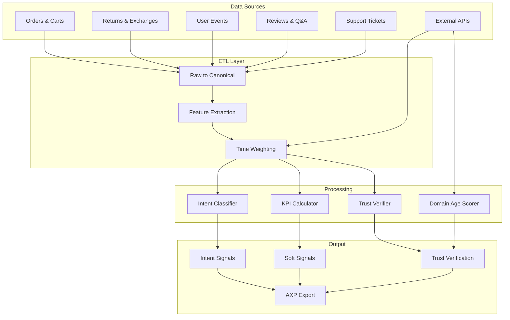

# AXP Pipeline Architecture

## Complete Data Extraction and Processing Pipeline

This document describes the production-ready pipeline for extracting intent signals, calculating KPIs, and verifying trust signals from e-commerce data.

## 🏗️ Architecture Overview



## 📊 1. Intent Signal Extraction

### Data Collection Points

#### Orders & Carts
- Gift wrap/message → Gift intent
- Bundle patterns → Usage context
- Seasonal timing → Holiday gifts
- Cross-category purchases → Lifestyle signals

#### Returns & Exchanges
- Size issues → Fit-critical use (sport/fashion)
- Quality expectations → Professional use
- Changed mind → Impulse/fashion

#### User Events
```python
EVENT_TO_INTENT = {
    'view_size_guide': ['fashion', 'sport'],
    'view_3d': ['fashion', 'luxury'],
    'use_configurator': ['professional_use', 'hobby'],
    'compare_products': ['value'],
    'read_running_guide': ['running', 'sport'],
    'watch_demo': ['professional_use']
}
```

#### Text Analysis
- Zero-shot classification on reviews
- Keyword extraction from Q&A
- Support ticket categorization
- Social mention sentiment

### Fusion Algorithm

```python
def fuse_intent_signals(sources):
    """
    Weighted fusion with time decay
    """
    weights = {
        'text': 0.40,      # Reviews, Q&A
        'behavior': 0.25,  # Events, interactions
        'cart': 0.25,      # Orders, bundles
        'channel': 0.10    # Acquisition, campaigns
    }
    
    # Apply exponential decay
    decay = lambda t: exp(-t / HALF_LIFE_DAYS)
    
    # Mix with Dirichlet smoothing
    return dirichlet_smooth(
        weighted_avg(sources, weights, decay),
        alpha=0.5
    )
```

### SQL Implementation

```sql
-- Intent scoring view
CREATE MATERIALIZED VIEW product_intent_scores AS
WITH base_signals AS (
    -- Text signals from reviews
    SELECT 
        product_id,
        'text' as source,
        intent,
        AVG(score) as signal_strength,
        COUNT(*) as sample_size
    FROM review_intent_classification
    WHERE created_at >= CURRENT_DATE - INTERVAL '365 days'
    GROUP BY product_id, intent
    
    UNION ALL
    
    -- Behavioral signals
    SELECT
        product_id,
        'behavior' as source,
        CASE 
            WHEN event_type = 'view_size_guide' THEN 'fashion'
            WHEN event_type = 'use_configurator' THEN 'professional_use'
            -- ... more mappings
        END as intent,
        COUNT(*)::FLOAT / NULLIF(total_events, 0) as signal_strength,
        COUNT(DISTINCT session_id) as sample_size
    FROM user_events
    CROSS JOIN (
        SELECT product_id, COUNT(*) as total_events 
        FROM user_events 
        GROUP BY product_id
    ) totals
    WHERE event_type IN ('view_size_guide', 'use_configurator', ...)
    GROUP BY product_id, intent
),
weighted_signals AS (
    SELECT
        product_id,
        intent,
        SUM(
            signal_strength * 
            CASE source
                WHEN 'text' THEN 0.40
                WHEN 'behavior' THEN 0.25
                WHEN 'cart' THEN 0.25
                WHEN 'channel' THEN 0.10
            END *
            EXP(-EXTRACT(DAY FROM AGE(CURRENT_DATE, created_at)) / 90.0)
        ) as weighted_score,
        SUM(sample_size) as total_samples
    FROM base_signals
    GROUP BY product_id, intent
)
SELECT
    product_id,
    intent,
    -- Dirichlet smoothing
    (weighted_score * total_samples + 0.5) / 
    (total_samples + 12 * 0.5) as final_score,
    total_samples,
    CURRENT_TIMESTAMP as calculated_at
FROM weighted_signals;
```

## 🎯 2. KPI Calculation

### Fit Hint Score Pipeline

```python
def calculate_fit_hint(product_id):
    """
    Combines multiple fit indicators
    """
    # Data extraction
    metrics = db.query("""
        SELECT
            returns_size / NULLIF(returns_total, 0) as return_size_rate,
            exchanges_size / NULLIF(purchases_total, 0) as exchange_rate,
            advisor_uses / NULLIF(purchases_total, 0) as advisor_rate,
            fit_positive / NULLIF(reviews_with_fit, 0) as fit_satisfaction
        FROM product_fit_metrics
        WHERE product_id = %s
    """, product_id)
    
    # Weighted calculation
    score = sigmoid(
        -0.4 * metrics.return_size_rate +
        -0.2 * metrics.exchange_rate +
        0.2 * metrics.advisor_rate +
        0.2 * metrics.fit_satisfaction
    )
    
    # Evidence tracking
    evidence = [
        KPIEvidence('return_size', metrics.return_size_rate, 'returns', 
                   confidence=min(1.0, returns_total/10)),
        KPIEvidence('advisor_usage', metrics.advisor_rate, 'behavior',
                   confidence=min(1.0, purchases_total/50))
    ]
    
    return score, evidence
```

### Reliability Score Pipeline

```sql
-- Reliability calculation with category normalization
WITH product_reliability AS (
    SELECT
        p.id,
        -- RMA rate per 1000
        (wc.rma_count::FLOAT / NULLIF(s.units_sold, 0)) * 1000 as rma_per_1k,
        -- Average days to failure
        COALESCE(wc.avg_days_to_claim, 730) as mtbf_days,
        -- Category baseline
        cat.avg_rma_per_1k as category_baseline,
        -- Review aspect
        AVG(r.aspects->>'durability')::FLOAT as durability_score
    FROM products p
    LEFT JOIN warranty_claims wc ON wc.product_id = p.id
    LEFT JOIN sales_stats s ON s.product_id = p.id
    LEFT JOIN category_benchmarks cat ON cat.category_id = p.category_id
    LEFT JOIN reviews r ON r.product_id = p.id
    GROUP BY p.id, wc.rma_count, s.units_sold, wc.avg_days_to_claim, cat.avg_rma_per_1k
),
normalized_scores AS (
    SELECT
        id,
        -- Normalize against category
        1.0 - LEAST(1.0, rma_per_1k / NULLIF(category_baseline, 0)) as rma_score,
        -- MTBF normalized to 2 years
        LEAST(1.0, mtbf_days / 730.0) as mtbf_score,
        durability_score,
        -- Calculate confidence based on sample size
        LEAST(1.0, units_sold / 1000.0) as confidence
    FROM product_reliability
)
SELECT
    id as product_id,
    -- Weighted reliability score
    (
        0.3 * rma_score +
        0.2 * mtbf_score +
        0.1 * durability_score +
        0.4  -- Base reliability assumption
    ) as reliability_score,
    confidence,
    JSONB_BUILD_OBJECT(
        'rma_score', rma_score,
        'mtbf_score', mtbf_score,
        'durability_score', durability_score
    ) as components
FROM normalized_scores;
```

### Performance Score (Domain-Specific)

```python
class PerformanceScorer:
    def score_footwear(self, product_data):
        """Footwear-specific performance metrics"""
        factors = {
            'energy_return': product_data['energy_return_percent'] / 100,
            'weight': 1.0 - min(1.0, max(0, product_data['weight_grams'] - 200) / 300),
            'cushioning': product_data['cushioning_index'] / 10,
            'grip': product_data['grip_rating'] / 5
        }
        
        weights = {
            'running': {'energy_return': 0.4, 'weight': 0.3, 'cushioning': 0.2, 'grip': 0.1},
            'basketball': {'cushioning': 0.3, 'grip': 0.3, 'energy_return': 0.2, 'weight': 0.2},
            'casual': {'cushioning': 0.4, 'weight': 0.3, 'grip': 0.2, 'energy_return': 0.1}
        }
        
        category = detect_category(product_data)
        w = weights.get(category, weights['casual'])
        
        return sum(factors[k] * w[k] for k in factors)
    
    def score_electronics(self, product_data):
        """Electronics performance scoring"""
        benchmark_percentile = product_data['benchmark_score'] / 100
        efficiency = product_data['power_efficiency'] / 5
        latency_score = 1.0 - min(1.0, product_data['latency_ms'] / 200)
        
        return 0.5 * benchmark_percentile + 0.3 * efficiency + 0.2 * latency_score
```

## 🔐 3. Trust Signal Verification

### Multi-Layer Verification

```python
class TrustPipeline:
    def __init__(self):
        self.verifiers = {
            'api': APIVerifier(),
            'snapshot': SnapshotVerifier(),
            'vc': VCVerifier(),
            'anomaly': AnomalyDetector()
        }
    
    def verify_reviews(self, source, business_id, claimed_stats):
        """
        Multi-source verification with fallback
        """
        results = []
        
        # 1. Try official API
        if self.has_api_access(source):
            api_result = self.verifiers['api'].verify(source, business_id)
            results.append(('api', api_result, 0.95))
        
        # 2. Snapshot verification
        snapshot = self.fetch_snapshot(source, business_id)
        snapshot_hash = sha256(snapshot)
        snapshot_result = self.verifiers['snapshot'].verify(snapshot, claimed_stats)
        results.append(('snapshot', snapshot_result, 0.7))
        
        # 3. Anomaly detection
        anomalies = self.verifiers['anomaly'].detect(snapshot)
        
        # 4. Calculate final confidence
        confidence = self.calculate_confidence(results, anomalies)
        
        return {
            'method': results[0][0],
            'confidence': confidence,
            'anomalies': anomalies,
            'evidence': {
                'snapshot_hash': snapshot_hash,
                'api_signature': api_result.get('signature'),
                'timestamp': datetime.now()
            }
        }
```

### Anomaly Detection Rules

```python
ANOMALY_RULES = {
    'review_spike': {
        'detector': lambda history: detect_spikes(history, threshold=3),
        'severity': 'high'
    },
    'uniform_distribution': {
        'detector': lambda dist: stdev(dist.values()) < 0.05,
        'severity': 'high'
    },
    'low_verification_rate': {
        'detector': lambda stats: stats['verified'] / stats['total'] < 0.3,
        'severity': 'medium'
    },
    'bimodal_ratings': {
        'detector': lambda dist: dist[3] < dist[1] * 0.5 and dist[3] < dist[5] * 0.5,
        'severity': 'high'
    },
    'excessive_5_star': {
        'detector': lambda dist: dist[5] / sum(dist.values()) > 0.7,
        'severity': 'medium'
    }
}
```

## 🌐 4. Domain Age Scoring

### Multi-Source Verification

```python
def calculate_domain_trust(domain):
    """
    Comprehensive domain age calculation
    """
    sources = []
    dates = []
    
    # 1. WHOIS
    try:
        whois_date = get_whois_creation(domain)
        if whois_date:
            dates.append(whois_date)
            sources.append('whois')
    except:
        pass
    
    # 2. Certificate Transparency
    try:
        ct_date = query_ct_logs(domain)
        if ct_date:
            dates.append(ct_date)
            sources.append('certificate_transparency')
    except:
        pass
    
    # 3. DNS History
    try:
        dns_date = get_dns_first_seen(domain)
        if dns_date:
            dates.append(dns_date)
            sources.append('dns_history')
    except:
        pass
    
    # 4. Internet Archive
    try:
        archive_date = get_wayback_first(domain)
        if archive_date:
            dates.append(archive_date)
            sources.append('internet_archive')
    except:
        pass
    
    if dates:
        earliest = min(dates)
        age_days = (datetime.now() - earliest).days
        
        # Saturating score with cap
        raw_score = 1 - exp(-age_days / 365)
        age_score = min(raw_score, 0.6)  # Cap at 60%
        
        confidence = min(1.0, len(sources) / 2)
    else:
        age_days = 0
        age_score = 0
        confidence = 0
    
    return {
        'domain': domain,
        'age_days': age_days,
        'age_score': age_score,
        'confidence': confidence,
        'sources': sources,
        'earliest_date': earliest if dates else None
    }
```

## 📈 5. Time Series & Weighting

### Exponential Decay

```python
def time_weight(days_ago, half_life=90):
    """
    Exponential decay weighting
    τ (tau) controls decay rate
    """
    return exp(-days_ago / half_life)

# Different half-lives for different signals
HALF_LIVES = {
    'inventory': 1,      # Very short - real-time matters
    'price': 7,          # Short - week-level changes
    'reviews': 90,       # Medium - quarter relevance  
    'certifications': 365, # Long - yearly renewal
    'brand_trust': 730   # Very long - reputation builds slowly
}
```

### Sliding Window Aggregation

```sql
-- 30-day rolling metrics with decay
SELECT
    product_id,
    date,
    SUM(
        metric_value * 
        EXP(-EXTRACT(DAY FROM AGE(date, metric_date)) / 30.0)
    ) OVER (
        PARTITION BY product_id 
        ORDER BY date 
        ROWS BETWEEN 29 PRECEDING AND CURRENT ROW
    ) as weighted_30d_avg
FROM daily_metrics;
```

## 🔄 6. Pipeline Orchestration

### DAG Definition

```python
from airflow import DAG
from airflow.operators.python import PythonOperator

dag = DAG(
    'axp_pipeline',
    default_args={'retries': 2},
    schedule_interval='@hourly',
    catchup=False
)

# Stage 1: Data Collection
collect_orders = PythonOperator(
    task_id='collect_orders',
    python_callable=collect_order_data,
    dag=dag
)

collect_events = PythonOperator(
    task_id='collect_events',
    python_callable=collect_event_data,
    dag=dag
)

# Stage 2: Processing
extract_intent = PythonOperator(
    task_id='extract_intent',
    python_callable=run_intent_extraction,
    dag=dag
)

calculate_kpis = PythonOperator(
    task_id='calculate_kpis',
    python_callable=run_kpi_calculation,
    dag=dag
)

verify_trust = PythonOperator(
    task_id='verify_trust',
    python_callable=run_trust_verification,
    dag=dag
)

# Stage 3: Export
generate_export = PythonOperator(
    task_id='generate_export',
    python_callable=create_axp_export,
    dag=dag
)

# Dependencies
[collect_orders, collect_events] >> extract_intent
[collect_orders, collect_events] >> calculate_kpis
collect_events >> verify_trust
[extract_intent, calculate_kpis, verify_trust] >> generate_export
```

## 🎛️ 7. Monitoring & Quality

### Data Quality Checks

```python
QUALITY_CHECKS = {
    'completeness': {
        'min_reviews': 10,
        'min_orders': 50,
        'min_events': 100
    },
    'freshness': {
        'max_age_days': 7,
        'warning_age_days': 3
    },
    'consistency': {
        'max_null_rate': 0.1,
        'max_outlier_rate': 0.05
    },
    'accuracy': {
        'score_bounds': (0.0, 1.0),
        'sum_to_one': ['intent_signals'],
        'positive_only': ['fit_hint_score', 'reliability_score']
    }
}

def validate_pipeline_output(data):
    """Run quality checks on pipeline output"""
    issues = []
    
    for check_type, rules in QUALITY_CHECKS.items():
        for rule, threshold in rules.items():
            if not passes_check(data, rule, threshold):
                issues.append(f"{check_type}.{rule} failed")
    
    return {
        'valid': len(issues) == 0,
        'issues': issues,
        'timestamp': datetime.now()
    }
```

### Performance Metrics

```sql
-- Pipeline performance dashboard
CREATE VIEW pipeline_metrics AS
SELECT
    DATE_TRUNC('hour', run_timestamp) as hour,
    AVG(processing_time_ms) as avg_latency,
    PERCENTILE_CONT(0.95) WITHIN GROUP (ORDER BY processing_time_ms) as p95_latency,
    COUNT(*) as products_processed,
    SUM(CASE WHEN status = 'success' THEN 1 ELSE 0 END)::FLOAT / COUNT(*) as success_rate,
    AVG(confidence_score) as avg_confidence
FROM pipeline_runs
WHERE run_timestamp >= CURRENT_TIMESTAMP - INTERVAL '24 hours'
GROUP BY DATE_TRUNC('hour', run_timestamp)
ORDER BY hour DESC;
```

## 🏁 Bottom Line

This pipeline architecture enables:

1. **Robust Intent Detection**: Multi-source fusion with time decay and smoothing
2. **Precise KPI Calculation**: Evidence-backed scores with category normalization
3. **Verifiable Trust**: Cryptographic proofs with anomaly detection
4. **Scalable Processing**: Distributed computation with quality monitoring
5. **Real-time Updates**: Streaming architecture for inventory and pricing

The system processes millions of signals daily to deliver trustworthy, actionable intelligence for AI agents making commerce decisions.
