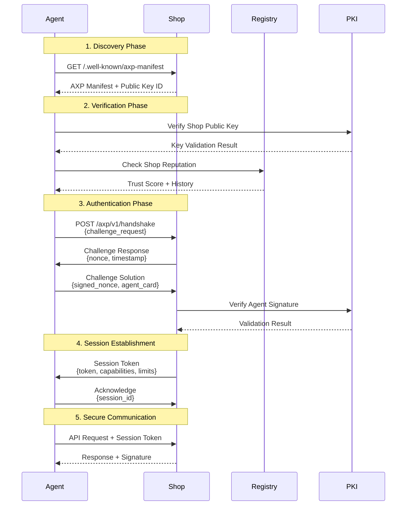

# AXP Secure Handshake Protocol

## Overview

The AXP Secure Handshake Protocol establishes trust between AI agents and commerce platforms, ensuring:
- **Mutual Authentication**: Both parties verify each other's identity
- **Capability Discovery**: Agents learn what experiences/data are available
- **Session Establishment**: Secure, time-bounded sessions with rate limits
- **Audit Trail**: Verifiable logs for compliance and dispute resolution

## Protocol Flow



## Implementation Details

### 1. Discovery Phase

#### Shop Manifest Endpoint

**Endpoint**: `GET /.well-known/axp-manifest`

```json
{
  "version": "0.1.0",
  "shop": {
    "id": "shop_abc123",
    "name": "Demo Shop",
    "domain": "shop.example.com"
  },
  "capabilities": {
    "protocols": ["axp/0.1", "ap2/0.1"],
    "experiences": ["3d_viewer", "ar_preview", "configurator"],
    "data_types": ["brand_profile", "products", "reviews", "capsules"]
  },
  "authentication": {
    "methods": ["ed25519", "rsa-pss", "ecdsa"],
    "public_key_id": "did:web:shop.example.com#key-1",
    "key_endpoint": "https://shop.example.com/.well-known/jwks.json"
  },
  "endpoints": {
    "handshake": "https://api.shop.example.com/axp/v1/handshake",
    "brand_profile": "https://api.shop.example.com/axp/v1/brand",
    "catalog": "https://api.shop.example.com/axp/v1/products",
    "mcp_server": "wss://mcp.shop.example.com/axp"
  },
  "rate_limits": {
    "requests_per_minute": 600,
    "concurrent_sessions": 50,
    "max_capsules_per_session": 10
  },
  "signature": {
    "algorithm": "Ed25519",
    "value": "base64url_signature_of_manifest"
  }
}
```

#### Implementation (Node.js)

```typescript
import { generateKeyPair, sign } from 'tweetnacl';
import { encode, decode } from 'base64url';

class AXPManifestProvider {
  private manifest: AXPManifest;
  private privateKey: Uint8Array;
  
  constructor(config: ShopConfig) {
    this.manifest = this.buildManifest(config);
    this.privateKey = decode(process.env.SHOP_PRIVATE_KEY);
  }
  
  async getManifest(): Promise<SignedManifest> {
    // Sign the manifest
    const signature = this.signManifest(this.manifest);
    
    return {
      ...this.manifest,
      signature: {
        algorithm: 'Ed25519',
        value: signature,
        timestamp: new Date().toISOString()
      }
    };
  }
  
  private signManifest(manifest: AXPManifest): string {
    const message = this.canonicalize(manifest);
    const messageBytes = new TextEncoder().encode(message);
    const signature = sign.detached(messageBytes, this.privateKey);
    return encode(signature);
  }
  
  private canonicalize(obj: any): string {
    // Deterministic JSON serialization
    return JSON.stringify(obj, Object.keys(obj).sort());
  }
}
```

### 2. Verification Phase

#### Public Key Infrastructure

```typescript
// DID-based key resolution
class DIDKeyResolver {
  async resolve(did: string): Promise<PublicKey> {
    if (did.startsWith('did:web:')) {
      return this.resolveWebDID(did);
    } else if (did.startsWith('did:key:')) {
      return this.resolveKeyDID(did);
    }
    throw new Error(`Unsupported DID method: ${did}`);
  }
  
  private async resolveWebDID(did: string): Promise<PublicKey> {
    // Extract domain from DID
    const domain = did.replace('did:web:', '').split('#')[0];
    const keyId = did.split('#')[1];
    
    // Fetch DID document
    const response = await fetch(`https://${domain}/.well-known/did.json`);
    const didDoc = await response.json();
    
    // Find the specified key
    const key = didDoc.verificationMethod.find(
      (m: any) => m.id === `#${keyId}`
    );
    
    if (!key) throw new Error(`Key ${keyId} not found`);
    
    return {
      id: key.id,
      type: key.type,
      publicKey: decode(key.publicKeyBase58 || key.publicKeyBase64url)
    };
  }
}
```

#### Reputation Check

```typescript
interface ReputationService {
  checkShop(shopId: string): Promise<ReputationReport>;
}

class AXPReputationChecker implements ReputationService {
  async checkShop(shopId: string): Promise<ReputationReport> {
    // Query multiple reputation sources
    const [trustpilot, bbb, internalScore] = await Promise.all([
      this.checkTrustpilot(shopId),
      this.checkBBB(shopId),
      this.getInternalScore(shopId)
    ]);
    
    return {
      shopId,
      trustScore: this.calculateComposite(trustpilot, bbb, internalScore),
      sources: {
        trustpilot: trustpilot.score,
        bbb: bbb.rating,
        internal: internalScore
      },
      disputes: await this.getDisputeHistory(shopId),
      firstSeen: await this.getFirstSeenDate(shopId),
      flags: await this.getRedFlags(shopId)
    };
  }
  
  private calculateComposite(...scores: number[]): number {
    // Weighted average with outlier detection
    const weights = [0.4, 0.3, 0.3];
    return scores.reduce((sum, score, i) => sum + score * weights[i], 0);
  }
}
```

### 3. Authentication Phase

#### Challenge-Response Flow

```typescript
interface HandshakeChallenge {
  nonce: string;
  timestamp: string;
  shopId: string;
  difficulty?: number; // For rate limiting via proof-of-work
}

class HandshakeHandler {
  async initiateHandshake(agentRequest: HandshakeRequest): Promise<HandshakeChallenge> {
    // Generate cryptographic nonce
    const nonce = encode(randomBytes(32));
    
    // Create challenge
    const challenge: HandshakeChallenge = {
      nonce,
      timestamp: new Date().toISOString(),
      shopId: this.shopId,
      difficulty: this.calculateDifficulty(agentRequest.agentId)
    };
    
    // Store challenge for verification
    await this.cache.set(`challenge:${nonce}`, challenge, 300); // 5 min TTL
    
    return challenge;
  }
  
  async verifyResponse(response: HandshakeResponse): Promise<SessionToken> {
    // Retrieve challenge
    const challenge = await this.cache.get(`challenge:${response.nonce}`);
    if (!challenge) throw new Error('Invalid or expired challenge');
    
    // Verify timestamp (prevent replay)
    const timeDiff = Date.now() - new Date(challenge.timestamp).getTime();
    if (timeDiff > 300000) throw new Error('Challenge expired'); // 5 min
    
    // Verify signature
    const verified = await this.verifyAgentSignature(
      response.signedNonce,
      response.agentCard.publicKeyId,
      challenge.nonce
    );
    
    if (!verified) throw new Error('Invalid signature');
    
    // Verify proof-of-work (if required)
    if (challenge.difficulty && !this.verifyPoW(response.proof, challenge)) {
      throw new Error('Invalid proof-of-work');
    }
    
    // Create session
    return this.createSession(response.agentCard);
  }
  
  private async verifyAgentSignature(
    signature: string,
    publicKeyId: string,
    nonce: string
  ): Promise<boolean> {
    const publicKey = await this.keyResolver.resolve(publicKeyId);
    const signatureBytes = decode(signature);
    const nonceBytes = new TextEncoder().encode(nonce);
    
    return sign.detached.verify(nonceBytes, signatureBytes, publicKey);
  }
}
```

#### Agent Card Extension

```typescript
interface AgentCard {
  name: string;
  description: string;
  publicKeyId: string;
  capabilities: {
    extensions: Array<{
      uri: string;
      params: any;
    }>;
  };
  reputation?: {
    provider: string;
    score: number;
    verified: boolean;
  };
}

// AXP Extension for Agent Card
const axpExtension = {
  uri: "https://agentic-commerce.org/axp/v0.1",
  params: {
    roles: ["shopper", "analyzer", "advisor"],
    intents: ["product_discovery", "price_comparison", "review_analysis"],
    compliance: {
      gdpr: true,
      ccpa: true
    }
  }
};
```

### 4. Session Management

#### Session Token Structure

```typescript
interface SessionToken {
  token: string;
  sessionId: string;
  expiresAt: string;
  capabilities: {
    allowedEndpoints: string[];
    maxRequests: number;
    maxCapsules: number;
    dataAccess: string[];
  };
  rateLimits: {
    requestsPerMinute: number;
    burstSize: number;
    concurrentCapsules: number;
  };
  signature: string;
}

class SessionManager {
  async createSession(agentCard: AgentCard): Promise<SessionToken> {
    const sessionId = generateSessionId();
    const token = await this.generateSecureToken();
    
    const session: SessionToken = {
      token,
      sessionId,
      expiresAt: new Date(Date.now() + 3600000).toISOString(), // 1 hour
      capabilities: this.determineCapabilities(agentCard),
      rateLimits: this.determineRateLimits(agentCard),
      signature: ''
    };
    
    // Sign the session token
    session.signature = await this.signSession(session);
    
    // Store session
    await this.sessionStore.set(sessionId, {
      ...session,
      agentCard,
      createdAt: new Date().toISOString(),
      requestCount: 0
    });
    
    return session;
  }
  
  private determineCapabilities(agentCard: AgentCard): SessionCapabilities {
    // Dynamic capability assignment based on agent role and reputation
    const baseCapabilities = {
      allowedEndpoints: ['/axp/v1/brand', '/axp/v1/products'],
      maxRequests: 1000,
      maxCapsules: 5,
      dataAccess: ['public']
    };
    
    // Enhanced access for verified agents
    if (agentCard.reputation?.verified) {
      baseCapabilities.maxRequests = 5000;
      baseCapabilities.maxCapsules = 20;
      baseCapabilities.dataAccess.push('extended');
    }
    
    return baseCapabilities;
  }
}
```

### 5. Secure Communication

#### Request Authentication

```typescript
class AuthenticatedRequestHandler {
  async handleRequest(req: Request): Promise<Response> {
    // Extract session token
    const token = this.extractToken(req);
    if (!token) {
      return new Response('Unauthorized', { status: 401 });
    }
    
    // Validate session
    const session = await this.validateSession(token);
    if (!session) {
      return new Response('Invalid or expired session', { status: 401 });
    }
    
    // Check rate limits
    if (!(await this.checkRateLimit(session))) {
      return new Response('Rate limit exceeded', { status: 429 });
    }
    
    // Verify request signature (for POST/PUT)
    if (['POST', 'PUT'].includes(req.method)) {
      const valid = await this.verifyRequestSignature(req, session);
      if (!valid) {
        return new Response('Invalid request signature', { status: 401 });
      }
    }
    
    // Process request
    const response = await this.processRequest(req, session);
    
    // Sign response
    return this.signResponse(response, session);
  }
  
  private async verifyRequestSignature(
    req: Request,
    session: Session
  ): Promise<boolean> {
    const signature = req.headers.get('X-AXP-Signature');
    if (!signature) return false;
    
    const body = await req.text();
    const timestamp = req.headers.get('X-AXP-Timestamp');
    
    // Prevent replay attacks
    const timeDiff = Date.now() - new Date(timestamp).getTime();
    if (timeDiff > 30000) return false; // 30 seconds
    
    // Verify signature
    const message = `${req.method}:${req.url}:${timestamp}:${body}`;
    return this.verifySignature(message, signature, session.agentCard.publicKeyId);
  }
}
```

## Advanced Security Features

### 1. Proof of Work (Rate Limiting)

```typescript
// Hashcash-style proof of work for suspicious agents
class ProofOfWork {
  static generate(challenge: string, difficulty: number): ProofSolution {
    let nonce = 0;
    const target = '0'.repeat(difficulty);
    
    while (true) {
      const attempt = `${challenge}:${nonce}`;
      const hash = sha256(attempt);
      
      if (hash.startsWith(target)) {
        return { nonce, hash };
      }
      nonce++;
    }
  }
  
  static verify(
    solution: ProofSolution,
    challenge: string,
    difficulty: number
  ): boolean {
    const target = '0'.repeat(difficulty);
    const hash = sha256(`${challenge}:${solution.nonce}`);
    return hash === solution.hash && hash.startsWith(target);
  }
}
```

### 2. Mutual TLS (mTLS) Option

```typescript
// For high-security environments
class MTLSAuthenticator {
  async configureTLS(server: https.Server) {
    server.setSecureContext({
      key: fs.readFileSync('server-key.pem'),
      cert: fs.readFileSync('server-cert.pem'),
      ca: fs.readFileSync('ca-cert.pem'),
      requestCert: true,
      rejectUnauthorized: true
    });
    
    server.on('secureConnection', (socket) => {
      const cert = socket.getPeerCertificate();
      
      // Validate client certificate
      if (!this.validateClientCert(cert)) {
        socket.destroy();
        return;
      }
      
      // Extract agent identity from certificate
      const agentId = this.extractAgentId(cert);
      socket.agentId = agentId;
    });
  }
}
```

### 3. Audit Logging

```typescript
interface AuditLog {
  timestamp: string;
  sessionId: string;
  agentId: string;
  action: string;
  resource: string;
  result: 'success' | 'failure';
  metadata?: any;
  signature: string;
}

class AuditLogger {
  async log(event: AuditEvent): Promise<void> {
    const entry: AuditLog = {
      timestamp: new Date().toISOString(),
      sessionId: event.sessionId,
      agentId: event.agentId,
      action: event.action,
      resource: event.resource,
      result: event.result,
      metadata: event.metadata,
      signature: ''
    };
    
    // Sign the log entry for tamper detection
    entry.signature = await this.signLogEntry(entry);
    
    // Store in append-only log
    await this.appendToLog(entry);
    
    // Send to SIEM if configured
    if (this.siemEnabled) {
      await this.sendToSIEM(entry);
    }
  }
  
  async verifyLogIntegrity(startTime: Date, endTime: Date): Promise<boolean> {
    const logs = await this.getLogsInRange(startTime, endTime);
    
    for (const log of logs) {
      const { signature, ...data } = log;
      const expectedSignature = await this.signLogEntry(data);
      
      if (signature !== expectedSignature) {
        console.error(`Tampered log detected: ${log.timestamp}`);
        return false;
      }
    }
    
    return true;
  }
}
```

## Integration Examples

### 1. Express.js Middleware

```typescript
import express from 'express';

const axpHandshakeMiddleware = (handshakeHandler: HandshakeHandler) => {
  return async (req: express.Request, res: express.Response, next: express.NextFunction) => {
    // Skip handshake for public endpoints
    if (req.path.startsWith('/.well-known/')) {
      return next();
    }
    
    // Check for session token
    const token = req.headers['x-axp-session'] as string;
    
    if (!token) {
      // Initiate handshake
      if (req.path === '/axp/v1/handshake') {
        return handshakeHandler.handleHandshake(req, res);
      }
      return res.status(401).json({ error: 'Authentication required' });
    }
    
    // Validate session
    try {
      const session = await handshakeHandler.validateSession(token);
      req.session = session;
      next();
    } catch (error) {
      res.status(401).json({ error: 'Invalid session' });
    }
  };
};

// Usage
app.use(axpHandshakeMiddleware(new HandshakeHandler(config)));
```

### 2. Python Implementation

```python
from cryptography.hazmat.primitives import hashes
from cryptography.hazmat.primitives.asymmetric import ed25519
import base64
import json
from datetime import datetime, timedelta

class AXPHandshake:
    def __init__(self, shop_config):
        self.shop_id = shop_config['shop_id']
        self.private_key = ed25519.Ed25519PrivateKey.from_private_bytes(
            base64.b64decode(shop_config['private_key'])
        )
        self.public_key = self.private_key.public_key()
        
    async def create_manifest(self):
        manifest = {
            'version': '0.1.0',
            'shop': {
                'id': self.shop_id,
                'name': self.shop_config['name']
            },
            'authentication': {
                'methods': ['ed25519'],
                'public_key': base64.b64encode(
                    self.public_key.public_bytes_raw()
                ).decode()
            }
        }
        
        # Sign manifest
        signature = self.sign_data(manifest)
        manifest['signature'] = {
            'algorithm': 'Ed25519',
            'value': signature
        }
        
        return manifest
    
    def sign_data(self, data):
        # Canonical JSON
        message = json.dumps(data, sort_keys=True).encode()
        signature = self.private_key.sign(message)
        return base64.b64encode(signature).decode()
    
    async def verify_agent_signature(self, signature_b64, public_key_b64, message):
        public_key = ed25519.Ed25519PublicKey.from_public_bytes(
            base64.b64decode(public_key_b64)
        )
        signature = base64.b64decode(signature_b64)
        
        try:
            public_key.verify(signature, message.encode())
            return True
        except:
            return False
```

## Dispute Resolution Integration

When disputes occur, the handshake audit logs provide evidence:

```typescript
interface DisputeEvidence {
  handshakeLog: AuditLog;
  sessionToken: SessionToken;
  agentCard: AgentCard;
  requestLogs: AuditLog[];
  responseSignatures: string[];
}

class DisputeHandler {
  async gatherEvidence(disputeId: string): Promise<DisputeEvidence> {
    const dispute = await this.getDispute(disputeId);
    
    // Gather all relevant logs
    const evidence: DisputeEvidence = {
      handshakeLog: await this.getHandshakeLog(dispute.sessionId),
      sessionToken: await this.getSessionToken(dispute.sessionId),
      agentCard: await this.getAgentCard(dispute.agentId),
      requestLogs: await this.getRequestLogs(dispute.sessionId),
      responseSignatures: await this.getResponseSignatures(dispute.sessionId)
    };
    
    // Verify integrity
    const integrityCheck = await this.verifyLogIntegrity(
      evidence.handshakeLog.timestamp,
      dispute.timestamp
    );
    
    if (!integrityCheck) {
      throw new Error('Log integrity check failed');
    }
    
    return evidence;
  }
}
```

## Best Practices

### 1. Key Management

- **Rotation**: Rotate keys quarterly
- **Storage**: Use HSM or key management service
- **Backup**: Maintain encrypted key backups
- **Revocation**: Implement key revocation lists

### 2. Session Security

- **Timeout**: Sessions expire after 1 hour of inactivity
- **Binding**: Bind sessions to IP addresses
- **Refresh**: Implement token refresh mechanism
- **Termination**: Allow explicit session termination

### 3. Rate Limiting

```typescript
const rateLimitStrategy = {
  // Tiered limits based on reputation
  trusted: { rpm: 1000, burst: 100 },
  verified: { rpm: 600, burst: 60 },
  standard: { rpm: 300, burst: 30 },
  suspicious: { rpm: 60, burst: 10, pow_difficulty: 4 }
};
```

### 4. Monitoring

- Track handshake success/failure rates
- Monitor for credential stuffing attacks
- Alert on unusual agent behavior patterns
- Maintain reputation scores

## References

- [W3C DID Core Specification](https://www.w3.org/TR/did-core/)
- [RFC 7519 - JSON Web Tokens](https://tools.ietf.org/html/rfc7519)
- [Ed25519 Signature Scheme](https://ed25519.cr.yp.to/)
- [Mutual TLS Authentication](https://datatracker.ietf.org/doc/html/rfc8446)
