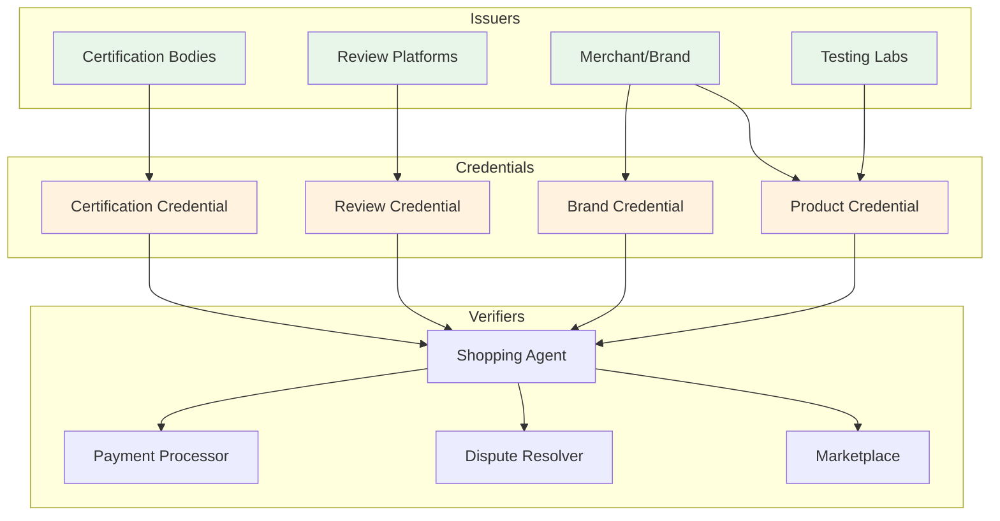

# AXP Verifiable Credentials for Trust Signals

## Overview

Verifiable Credentials (VCs) provide a tamper-proof mechanism for trust signal validation in the AXP ecosystem. This enables merchants, certification bodies, and review platforms to issue cryptographically verifiable claims about products, brands, and quality metrics.



## Credential Types

### 1. Product Quality Credential

Verifiable claims about product characteristics and quality:

```json
{
  "@context": [
    "https://www.w3.org/2018/credentials/v1",
    "https://agentic-commerce.org/axp/v1/credentials"
  ],
  "id": "urn:uuid:3978344f-8596-4c3a-a978-8fcaba3903c5",
  "type": ["VerifiableCredential", "AXPProductQualityCredential"],
  "issuer": {
    "id": "did:web:certifier.example.com",
    "name": "Trusted Quality Labs"
  },
  "issuanceDate": "2025-09-18T10:30:00Z",
  "expirationDate": "2026-09-18T10:30:00Z",
  "credentialSubject": {
    "id": "did:axp:product:sku_123",
    "productIdentifier": {
      "gtin": "00012345678905",
      "mpn": "SHOE-RED-2025"
    },
    "qualityMetrics": {
      "durabilityScore": 0.92,
      "materialQuality": "premium",
      "workmanshipRating": 4.8,
      "defectRate": 0.002
    },
    "testResults": {
      "flexTest": {
        "cycles": 100000,
        "passed": true,
        "standard": "ISO 17707"
      },
      "colorFastness": {
        "rating": 4.5,
        "standard": "ISO 105-X12"
      }
    },
    "certifications": [
      {
        "name": "ISO 9001:2015",
        "scope": "Manufacturing Process",
        "validUntil": "2026-12-31"
      }
    ]
  },
  "evidence": [
    {
      "id": "https://certifier.example.com/reports/2025/09/123",
      "type": ["TestReport"],
      "name": "Product Testing Report #123",
      "date": "2025-09-15"
    }
  ],
  "proof": {
    "type": "Ed25519Signature2020",
    "created": "2025-09-18T10:30:00Z",
    "proofPurpose": "assertionMethod",
    "verificationMethod": "did:web:certifier.example.com#key-1",
    "proofValue": "z58DAdFfa9SkqZMVPxAQp..."
  }
}
```

### 2. Brand Trust Credential

Verifiable brand reputation and operational metrics:

```json
{
  "@context": [
    "https://www.w3.org/2018/credentials/v1",
    "https://agentic-commerce.org/axp/v1/credentials"
  ],
  "type": ["VerifiableCredential", "AXPBrandTrustCredential"],
  "issuer": {
    "id": "did:web:trustpilot.com",
    "name": "Trustpilot"
  },
  "credentialSubject": {
    "id": "did:web:merchant.example.com",
    "brandName": "Example Merchant",
    "trustMetrics": {
      "overallRating": 4.6,
      "reviewCount": 12873,
      "verifiedReviewPercentage": 0.89,
      "recommendationRate": 0.87,
      "responseRate": 0.92,
      "responseTime": "PT4H"
    },
    "historicalPerformance": {
      "consistencyScore": 0.91,
      "improvementTrend": "+0.3",
      "disputeRate": 0.018,
      "resolutionRate": 0.94
    }
  }
}
```

### 3. Sustainability Credential

Environmental and ethical compliance verification:

```json
{
  "@context": [
    "https://www.w3.org/2018/credentials/v1",
    "https://agentic-commerce.org/axp/v1/credentials"
  ],
  "type": ["VerifiableCredential", "AXPSustainabilityCredential"],
  "issuer": {
    "id": "did:web:bcorporation.net",
    "name": "B Corporation"
  },
  "credentialSubject": {
    "id": "did:web:merchant.example.com",
    "sustainabilityScore": 0.78,
    "certifications": [
      {
        "type": "B-Corp",
        "score": 110.2,
        "validUntil": "2027-03-31"
      },
      {
        "type": "CarbonNeutral",
        "scope": "Operations & Shipping",
        "verifier": "Climate Partner"
      }
    ],
    "metrics": {
      "recycledMaterials": 0.65,
      "renewableEnergy": 0.80,
      "wasteReduction": 0.45,
      "fairLaborPractices": true,
      "supplyChainTransparency": 0.72
    }
  }
}
```

## Implementation

### 1. Credential Issuer

```typescript
import { Ed25519VerificationKey2020 } from '@digitalbazaar/ed25519-verification-key-2020';
import { Ed25519Signature2020 } from '@digitalbazaar/ed25519-signature-2020';
import vc from '@digitalbazaar/vc';

class AXPCredentialIssuer {
  private suite: Ed25519Signature2020;
  private documentLoader: any;
  
  constructor(privateKey: string, publicKeyId: string) {
    const key = new Ed25519VerificationKey2020({
      privateKeyBase58: privateKey,
      id: publicKeyId
    });
    
    this.suite = new Ed25519Signature2020({
      key,
      date: new Date().toISOString()
    });
    
    this.documentLoader = this.createDocumentLoader();
  }
  
  async issueProductCredential(
    product: AXPProduct,
    qualityData: QualityMetrics
  ): Promise<VerifiableCredential> {
    const credential = {
      '@context': [
        'https://www.w3.org/2018/credentials/v1',
        'https://agentic-commerce.org/axp/v1/credentials'
      ],
      id: `urn:uuid:${this.generateUUID()}`,
      type: ['VerifiableCredential', 'AXPProductQualityCredential'],
      issuer: {
        id: this.issuerId,
        name: this.issuerName
      },
      issuanceDate: new Date().toISOString(),
      expirationDate: this.calculateExpiry(),
      credentialSubject: {
        id: `did:axp:product:${product.id}`,
        productIdentifier: {
          sku: product.id,
          gtin: product.gtin,
          mpn: product.mpn
        },
        qualityMetrics: {
          uniquenessScore: product.soft_signals.uniqueness_score,
          craftsmanshipScore: product.soft_signals.craftsmanship_score,
          sustainabilityScore: product.soft_signals.sustainability_score,
          innovationScore: product.soft_signals.innovation_score
        },
        trustSignals: {
          averageRating: product.trust_signals.review_summary.avg_rating,
          reviewCount: product.trust_signals.review_summary.count_total,
          returnRate: product.trust_signals.return_rate,
          warrantyDays: product.trust_signals.warranty_days
        },
        evidence: this.gatherEvidence(product, qualityData)
      }
    };
    
    // Issue the verifiable credential
    const verifiableCredential = await vc.issue({
      credential,
      suite: this.suite,
      documentLoader: this.documentLoader
    });
    
    // Store in registry
    await this.registry.store(verifiableCredential);
    
    return verifiableCredential;
  }
  
  async issueBrandCredential(
    brand: BrandProfile
  ): Promise<VerifiableCredential> {
    const credential = {
      '@context': [
        'https://www.w3.org/2018/credentials/v1',
        'https://agentic-commerce.org/axp/v1/credentials'
      ],
      type: ['VerifiableCredential', 'AXPBrandTrustCredential'],
      issuer: this.issuerId,
      credentialSubject: {
        id: `did:web:${brand.domains[0]}`,
        brandId: brand.id,
        legalName: brand.legal_name,
        trustMetrics: {
          customerSatisfaction: brand.csat,
          netPromoterScore: brand.nps,
          returnRate: brand.return_rate,
          firstResponseHours: brand.service_sla.first_response_hours
        },
        certifications: brand.certifications.map(cert => ({
          name: cert,
          verified: true,
          verificationDate: new Date().toISOString()
        })),
        ratings: brand.independent_ratings
      }
    };
    
    return await vc.issue({
      credential,
      suite: this.suite,
      documentLoader: this.documentLoader
    });
  }
  
  private gatherEvidence(
    product: AXPProduct,
    qualityData: QualityMetrics
  ): Evidence[] {
    const evidence = [];
    
    // Add test reports
    if (qualityData.testReports) {
      evidence.push(...qualityData.testReports.map(report => ({
        id: report.url,
        type: ['TestReport'],
        name: report.name,
        date: report.date,
        hash: report.documentHash
      })));
    }
    
    // Add certification documents
    if (product.certifications) {
      evidence.push(...product.certifications.map(cert => ({
        id: cert.documentUrl,
        type: ['Certification'],
        name: cert.name,
        issuer: cert.issuer,
        validUntil: cert.expiryDate
      })));
    }
    
    return evidence;
  }
}
```

### 2. Credential Verifier

```typescript
class AXPCredentialVerifier {
  private documentLoader: any;
  private trustedIssuers: Set<string>;
  
  constructor(config: VerifierConfig) {
    this.documentLoader = this.createDocumentLoader(config);
    this.trustedIssuers = new Set(config.trustedIssuers);
  }
  
  async verifyCredential(
    credential: any,
    options?: VerificationOptions
  ): Promise<VerificationResult> {
    try {
      // Basic verification
      const result = await vc.verifyCredential({
        credential,
        suite: new Ed25519Signature2020(),
        documentLoader: this.documentLoader
      });
      
      if (!result.verified) {
        return {
          valid: false,
          error: result.error?.message || 'Signature verification failed',
          checks: result.results
        };
      }
      
      // Check issuer trust
      const issuerTrusted = this.checkIssuerTrust(credential.issuer);
      if (!issuerTrusted) {
        return {
          valid: false,
          error: 'Untrusted issuer',
          issuer: credential.issuer
        };
      }
      
      // Check expiration
      if (this.isExpired(credential)) {
        return {
          valid: false,
          error: 'Credential expired',
          expirationDate: credential.expirationDate
        };
      }
      
      // Check revocation
      const revoked = await this.checkRevocation(credential);
      if (revoked) {
        return {
          valid: false,
          error: 'Credential revoked',
          revocationDate: revoked.date
        };
      }
      
      // Additional business logic checks
      const businessValid = await this.validateBusinessRules(
        credential,
        options
      );
      
      return {
        valid: businessValid.valid,
        issuer: credential.issuer,
        subject: credential.credentialSubject,
        issuanceDate: credential.issuanceDate,
        evidence: credential.evidence,
        checks: {
          signature: true,
          issuerTrust: true,
          expiration: true,
          revocation: false,
          businessRules: businessValid.valid
        }
      };
      
    } catch (error) {
      return {
        valid: false,
        error: error.message,
        exception: error
      };
    }
  }
  
  async verifyPresentation(
    presentation: any
  ): Promise<PresentationVerificationResult> {
    // Verify the presentation itself
    const presentationResult = await vc.verify({
      presentation,
      suite: new Ed25519Signature2020(),
      documentLoader: this.documentLoader
    });
    
    if (!presentationResult.verified) {
      return {
        valid: false,
        error: 'Presentation verification failed'
      };
    }
    
    // Verify each credential in the presentation
    const credentialResults = [];
    for (const credential of presentation.verifiableCredential) {
      const result = await this.verifyCredential(credential);
      credentialResults.push(result);
    }
    
    // Check presentation rules (e.g., required credentials)
    const rulesValid = this.checkPresentationRules(
      presentation,
      credentialResults
    );
    
    return {
      valid: credentialResults.every(r => r.valid) && rulesValid,
      presentation: presentationResult,
      credentials: credentialResults,
      holder: presentation.holder
    };
  }
  
  private async checkRevocation(credential: any): Promise<RevocationInfo | null> {
    // Check against revocation list
    if (credential.credentialStatus) {
      const status = await this.revocationChecker.check(
        credential.credentialStatus
      );
      
      if (status.revoked) {
        return {
          revoked: true,
          date: status.revocationDate,
          reason: status.reason
        };
      }
    }
    
    return null;
  }
  
  private async validateBusinessRules(
    credential: any,
    options?: VerificationOptions
  ): Promise<BusinessValidation> {
    const rules = [];
    
    // Check credential type is supported
    if (options?.requiredTypes) {
      const hasRequiredType = options.requiredTypes.some(
        type => credential.type.includes(type)
      );
      
      rules.push({
        rule: 'required_type',
        valid: hasRequiredType
      });
    }
    
    // Check minimum quality scores
    if (options?.minimumScores) {
      const subject = credential.credentialSubject;
      
      for (const [metric, minValue] of Object.entries(options.minimumScores)) {
        const actualValue = this.getNestedValue(subject, metric);
        rules.push({
          rule: `minimum_${metric}`,
          valid: actualValue >= minValue,
          expected: minValue,
          actual: actualValue
        });
      }
    }
    
    // Check evidence requirements
    if (options?.requireEvidence && !credential.evidence?.length) {
      rules.push({
        rule: 'evidence_required',
        valid: false
      });
    }
    
    return {
      valid: rules.every(r => r.valid),
      rules
    };
  }
}
```

### 3. Credential Presentation

```typescript
class CredentialPresenter {
  private holder: any;
  private credentials: Map<string, VerifiableCredential>;
  
  async createPresentation(
    request: PresentationRequest
  ): Promise<VerifiablePresentation> {
    // Select credentials matching the request
    const selectedCredentials = await this.selectCredentials(request);
    
    if (selectedCredentials.length === 0) {
      throw new Error('No matching credentials found');
    }
    
    // Create presentation
    const presentation = {
      '@context': [
        'https://www.w3.org/2018/credentials/v1',
        'https://agentic-commerce.org/axp/v1/presentations'
      ],
      type: ['VerifiablePresentation', 'AXPProductPresentation'],
      holder: this.holder.id,
      verifiableCredential: selectedCredentials
    };
    
    // Sign presentation
    const vp = await vc.signPresentation({
      presentation,
      suite: this.holder.suite,
      documentLoader: this.documentLoader,
      challenge: request.challenge,
      domain: request.domain
    });
    
    return vp;
  }
  
  private async selectCredentials(
    request: PresentationRequest
  ): Promise<VerifiableCredential[]> {
    const selected = [];
    
    for (const requirement of request.requirements) {
      const matching = await this.findMatchingCredentials(requirement);
      
      if (requirement.required && matching.length === 0) {
        throw new Error(`No credential found for required type: ${requirement.type}`);
      }
      
      // Select best matching credential
      if (matching.length > 0) {
        const best = this.selectBest(matching, requirement);
        selected.push(best);
      }
    }
    
    // Add optional credentials that enhance the presentation
    const optional = await this.selectOptionalEnhancements(
      request,
      selected
    );
    selected.push(...optional);
    
    return selected;
  }
  
  private selectBest(
    credentials: VerifiableCredential[],
    requirement: CredentialRequirement
  ): VerifiableCredential {
    // Sort by issuance date (prefer newer)
    const sorted = credentials.sort((a, b) => {
      const dateA = new Date(a.issuanceDate).getTime();
      const dateB = new Date(b.issuanceDate).getTime();
      return dateB - dateA;
    });
    
    // Additional scoring based on requirements
    if (requirement.preferredIssuers) {
      for (const cred of sorted) {
        if (requirement.preferredIssuers.includes(cred.issuer.id)) {
          return cred;
        }
      }
    }
    
    return sorted[0];
  }
}
```

### 4. Revocation Management

```typescript
class RevocationManager {
  private revocationLists: Map<string, RevocationList>;
  
  async revokeCredential(
    credentialId: string,
    reason: RevocationReason
  ): Promise<RevocationStatus> {
    // Find the appropriate revocation list
    const listId = this.getRevocationListId(credentialId);
    let list = this.revocationLists.get(listId);
    
    if (!list) {
      list = await this.createRevocationList(listId);
    }
    
    // Add to revocation list
    const entry = {
      credentialId,
      revocationDate: new Date().toISOString(),
      reason: reason.code,
      description: reason.description
    };
    
    list.revokedCredentials.push(entry);
    
    // Sign and publish updated list
    const signedList = await this.signRevocationList(list);
    await this.publishRevocationList(signedList);
    
    // Notify interested parties
    await this.notifyRevocation(credentialId, reason);
    
    return {
      revoked: true,
      listId,
      entry,
      publishedAt: new Date().toISOString()
    };
  }
  
  async checkRevocationStatus(
    credentialStatus: CredentialStatus
  ): Promise<boolean> {
    const list = await this.fetchRevocationList(credentialStatus.id);
    
    return list.revokedCredentials.some(
      entry => entry.credentialId === credentialStatus.credentialId
    );
  }
  
  private async createRevocationList(id: string): Promise<RevocationList> {
    return {
      '@context': 'https://w3id.org/vc-revocation-list-2020/v1',
      id,
      type: 'RevocationList2020',
      issuer: this.issuerId,
      issuanceDate: new Date().toISOString(),
      revokedCredentials: []
    };
  }
}
```

## Integration Patterns

### 1. Agent Shopping Flow with Credentials

```typescript
class CredentialEnabledAgent {
  private verifier: AXPCredentialVerifier;
  private requiredCredentials: CredentialRequirement[];
  
  async shopWithCredentials(intent: string): Promise<Purchase> {
    // Search for products
    const products = await this.searchProducts(intent);
    
    // Request credentials for each product
    const productsWithCredentials = await Promise.all(
      products.map(async product => {
        const credentials = await this.requestCredentials(product.id);
        const verified = await this.verifyAllCredentials(credentials);
        
        return {
          ...product,
          credentials: verified.filter(c => c.valid),
          trustScore: this.calculateTrustScore(verified)
        };
      })
    );
    
    // Rank by credential-backed trust
    const ranked = productsWithCredentials.sort(
      (a, b) => b.trustScore - a.trustScore
    );
    
    // Select product with best credentials
    const selected = ranked[0];
    
    // Include credentials in purchase for evidence
    return this.purchaseWithCredentials(selected);
  }
  
  private calculateTrustScore(credentials: VerificationResult[]): number {
    let score = 0;
    const weights = {
      'AXPProductQualityCredential': 0.3,
      'AXPBrandTrustCredential': 0.2,
      'AXPSustainabilityCredential': 0.2,
      'ReviewCredential': 0.15,
      'CertificationCredential': 0.15
    };
    
    for (const cred of credentials) {
      if (cred.valid) {
        const type = cred.credential.type[1]; // Get specific type
        const weight = weights[type] || 0.1;
        
        // Factor in issuer trust
        const issuerTrust = this.getIssuerTrustScore(cred.issuer);
        
        score += weight * issuerTrust;
      }
    }
    
    return Math.min(score, 1.0);
  }
}
```

### 2. Merchant Credential Service

```typescript
// API endpoints for credential management
class MerchantCredentialAPI {
  @Post('/credentials/request')
  async requestCredential(req: CredentialRequest): Promise<CredentialResponse> {
    // Verify requester identity
    const requester = await this.authenticateRequester(req);
    
    // Check authorization
    if (!this.authorizeCredentialRequest(requester, req)) {
      throw new UnauthorizedException();
    }
    
    // Gather required data
    const data = await this.gatherCredentialData(req);
    
    // Issue credential
    const credential = await this.issuer.issueCredential(
      req.type,
      req.subject,
      data
    );
    
    // Log issuance
    await this.auditLog.recordIssuance(credential, requester);
    
    return {
      credential,
      presentation: await this.createPresentation(credential, req)
    };
  }
  
  @Get('/credentials/:productId')
  async getProductCredentials(productId: string): Promise<CredentialBundle> {
    const credentials = await this.credentialStore.getBySubject(
      `did:axp:product:${productId}`
    );
    
    // Filter expired/revoked
    const valid = await this.filterValidCredentials(credentials);
    
    // Group by type
    const grouped = this.groupCredentialsByType(valid);
    
    return {
      product_id: productId,
      credentials: grouped,
      summary: this.generateCredentialSummary(grouped)
    };
  }
  
  @Post('/credentials/verify')
  async verifyCredential(req: VerifyRequest): Promise<VerificationResult> {
    return this.verifier.verifyCredential(
      req.credential,
      req.options
    );
  }
  
  @Post('/credentials/revoke')
  @RequireRole('admin')
  async revokeCredential(req: RevokeRequest): Promise<RevocationStatus> {
    return this.revocationManager.revokeCredential(
      req.credentialId,
      req.reason
    );
  }
}
```

### 3. Credential Registry

```typescript
class DecentralizedCredentialRegistry {
  private ipfs: IPFSClient;
  private blockchain: BlockchainClient;
  
  async registerCredential(
    credential: VerifiableCredential
  ): Promise<RegistrationReceipt> {
    // Store credential in IPFS
    const ipfsHash = await this.ipfs.add(JSON.stringify(credential));
    
    // Create registry entry
    const entry = {
      credentialId: credential.id,
      issuer: credential.issuer.id,
      subject: credential.credentialSubject.id,
      type: credential.type,
      issuanceDate: credential.issuanceDate,
      ipfsHash,
      status: 'active'
    };
    
    // Anchor to blockchain
    const txHash = await this.blockchain.registerCredential(entry);
    
    // Index for search
    await this.indexer.index(credential, ipfsHash, txHash);
    
    return {
      credentialId: credential.id,
      ipfsHash,
      blockchainTx: txHash,
      registeredAt: new Date().toISOString()
    };
  }
  
  async lookupCredential(id: string): Promise<RegisteredCredential> {
    // Check blockchain registry
    const entry = await this.blockchain.getCredentialEntry(id);
    
    if (!entry) {
      throw new Error('Credential not found in registry');
    }
    
    // Fetch from IPFS
    const credential = await this.ipfs.get(entry.ipfsHash);
    
    // Verify integrity
    const valid = await this.verifyIntegrity(credential, entry);
    
    return {
      credential,
      registration: entry,
      valid
    };
  }
}
```

## Use Cases

### 1. Premium Product Authentication

```typescript
// Luxury goods authentication
class LuxuryAuthenticator {
  async authenticateProduct(
    productId: string,
    physicalId: string // Serial number, NFC tag, etc.
  ): Promise<AuthenticationResult> {
    // Request all credentials
    const credentials = await this.credentialService.getProductCredentials(productId);
    
    // Verify manufacturer credential
    const mfgCredential = credentials.find(
      c => c.type.includes('ManufacturerCredential')
    );
    
    if (!mfgCredential || !await this.verifyCredential(mfgCredential)) {
      return { authentic: false, reason: 'No valid manufacturer credential' };
    }
    
    // Check physical-digital link
    const linkedCredential = credentials.find(
      c => c.credentialSubject.physicalId === physicalId
    );
    
    if (!linkedCredential) {
      return { authentic: false, reason: 'Physical ID mismatch' };
    }
    
    // Verify chain of custody
    const custodyCredentials = credentials.filter(
      c => c.type.includes('CustodyCredential')
    );
    
    const validChain = await this.verifyCustodyChain(custodyCredentials);
    
    return {
      authentic: validChain,
      credentials: credentials.map(c => c.id),
      confidence: this.calculateConfidence(credentials)
    };
  }
}
```

### 2. Sustainability Claims Verification

```typescript
// Verify environmental claims
class SustainabilityVerifier {
  async verifyClaims(
    product: AXPProduct
  ): Promise<SustainabilityVerification> {
    const claims = product.sustainability_claims;
    const verified = [];
    
    for (const claim of claims) {
      // Request credential for claim
      const credential = await this.requestClaimCredential(claim);
      
      if (credential) {
        const verification = await this.verifier.verifyCredential(credential);
        
        verified.push({
          claim,
          verified: verification.valid,
          credential: credential.id,
          issuer: credential.issuer,
          evidence: credential.evidence
        });
      } else {
        verified.push({
          claim,
          verified: false,
          reason: 'No credential found'
        });
      }
    }
    
    return {
      product_id: product.id,
      claims: verified,
      overall_verification: verified.filter(v => v.verified).length / verified.length,
      trust_score: this.calculateSustainabilityTrust(verified)
    };
  }
}
```

## Best Practices

### 1. Privacy Preservation

```typescript
// Selective disclosure using BBS+ signatures
class PrivacyPreservingPresenter {
  async createMinimalPresentation(
    request: PresentationRequest,
    credential: VerifiableCredential
  ): Promise<VerifiablePresentation> {
    // Derive proof that reveals only required attributes
    const derivedProof = await this.deriveProof(
      credential,
      request.requiredAttributes
    );
    
    // Create presentation with minimal disclosure
    return {
      '@context': credential['@context'],
      type: ['VerifiablePresentation'],
      verifiableCredential: [{
        ...credential,
        credentialSubject: this.filterAttributes(
          credential.credentialSubject,
          request.requiredAttributes
        ),
        proof: derivedProof
      }]
    };
  }
}
```

### 2. Credential Lifecycle Management

```typescript
const credentialLifecycle = {
  issuance: {
    defaultExpiry: 365, // days
    renewalWindow: 30,  // days before expiry
    maxRenewals: 3
  },
  revocation: {
    gracePeriod: 24,   // hours
    notificationRequired: true,
    appealWindow: 7    // days
  },
  archival: {
    activeRetention: 365,     // days
    revokedRetention: 2555,   // 7 years
    evidenceRetention: 3650   // 10 years
  }
};
```

### 3. Performance Optimization

```typescript
// Credential caching strategy
class CredentialCache {
  private cache: LRUCache<string, CachedCredential>;
  
  constructor() {
    this.cache = new LRUCache({
      max: 1000,
      ttl: 3600000, // 1 hour
      updateAgeOnGet: true
    });
  }
  
  async getCredential(id: string): Promise<VerifiableCredential> {
    // Check cache first
    const cached = this.cache.get(id);
    
    if (cached && !this.isStale(cached)) {
      return cached.credential;
    }
    
    // Fetch and cache
    const credential = await this.fetchCredential(id);
    
    // Verify before caching
    const valid = await this.quickVerify(credential);
    if (valid) {
      this.cache.set(id, {
        credential,
        cachedAt: Date.now(),
        verified: true
      });
    }
    
    return credential;
  }
}
```

## Testing

```typescript
describe('Verifiable Credentials', () => {
  test('issues valid product credential', async () => {
    const product = createTestProduct();
    const credential = await issuer.issueProductCredential(product);
    
    expect(credential).toHaveProperty('proof');
    expect(credential.type).toContain('AXPProductQualityCredential');
    expect(credential.credentialSubject.id).toBe(`did:axp:product:${product.id}`);
  });
  
  test('verifies authentic credential', async () => {
    const credential = await createTestCredential();
    const result = await verifier.verifyCredential(credential);
    
    expect(result.valid).toBe(true);
    expect(result.checks.signature).toBe(true);
    expect(result.checks.expiration).toBe(true);
  });
  
  test('rejects tampered credential', async () => {
    const credential = await createTestCredential();
    credential.credentialSubject.uniquenessScore = 1.0; // Tamper
    
    const result = await verifier.verifyCredential(credential);
    
    expect(result.valid).toBe(false);
    expect(result.error).toContain('verification failed');
  });
  
  test('handles credential revocation', async () => {
    const credential = await createTestCredential();
    
    // Revoke credential
    await revocationManager.revokeCredential(
      credential.id,
      { code: 'security', description: 'Compromised key' }
    );
    
    // Verification should fail
    const result = await verifier.verifyCredential(credential);
    
    expect(result.valid).toBe(false);
    expect(result.checks.revocation).toBe(true);
  });
});
```

## References

- [W3C Verifiable Credentials Data Model](https://www.w3.org/TR/vc-data-model/)
- [DID Core Specification](https://www.w3.org/TR/did-core/)
- [BBS+ Signatures](https://identity.foundation/bbs-signature/)
- [Verifiable Credentials Implementation Guide](https://w3c.github.io/vc-imp-guide/)
